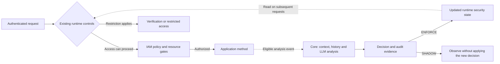

<p align="center">
  
</p>

<p align="center">
  <strong>Open-source AI-native Post-Authentication Runtime Control Plane</strong>
</p>

<p align="center">
  <a href="LICENSE"></a>
  <a href="https://openjdk.org/"></a>
  <a href="https://spring.io/projects/spring-boot"></a>
</p>

> **Security does not end at login.**

Contexa brings AI-based security decisions into your Spring Boot application **after authentication**. It combines the authenticated identity, requested resource, available business context, and recent activity to assess whether access still makes sense. The application can then require additional verification, restrict access, or allow work to continue.

Your login establishes who is making a request. Your authorization policy establishes what they may access. Contexa adds runtime evaluation of **what that authenticated identity is doing in context**.

**[Try the demo](https://demo.ctxa.ai)** · **[Get started](#get-started)** · [Documentation](https://docs.ctxa.ai) · [Examples](#examples) · [Website](https://ctxa.ai)

## See the value

Consider an employee who is allowed to read settlement documents. A valid login and the correct role remain the same across these situations:

| Available context | What Contexa evaluates | Possible response |
|---|---|---|
| Reads records relevant to an assigned settlement task | Whether access fits the task and recent activity | Continue the work |
| The same identity starts accessing unrelated customer records | Whether the stated purpose and actual behavior are consistent | Require additional verification |
| Activity provides evidence of continued misuse | Whether access should remain available | Restrict access and record the reason |

These are illustrative outcomes, not guaranteed model answers. Decisions depend on the context supplied, configured policies, model, and operating mode.

In the [demo](https://demo.ctxa.ai), follow the complete experience: **perform a task → inspect the security decision and its evidence → observe any access restriction → follow the available verification or recovery path**. Compare the analysis result with the actual application response; a proposed action alone does not prove enforcement.

## Get started

This path adds Contexa to an **existing Spring Boot application**. If you want a guided experience before integrating code, start with the demo above. If you need an example application, see [Examples](#examples).

**Requirements:** Java 17+, Spring Boot 3.5.x, and a Maven or Gradle project. AI analysis also needs a configured Contexa database and chat/embedding models. Use PostgreSQL with pgvector for the PostgreSQL vector-store setup. Ollama provides a local model option; cloud providers need their own credentials. Docker is needed only when provisioning containerized infrastructure.

> [!IMPORTANT]
> This README targets Contexa **`0.1.0`**. Spring Boot **4.x is not supported**. Check the version generated by the CLI or supplied by an example and keep the starter dependency at `0.1.0`.
>
> **Distribution status, checked October 5, 2026:** the `0.1.0` starter POM was not available at its [Maven Central location](https://repo.maven.apache.org/maven2/ai/ctxa/spring-boot-starter-contexa/0.1.0/spring-boot-starter-contexa-0.1.0.pom). Until it is published, use the local source-build steps below. Installing the CLI does not make the library artifact available.

<details>
<summary><strong>Build the 0.1.0 libraries locally while Maven Central publication is pending</strong></summary>

Install Git, JDK 17, and Node.js; the repository's Java style check uses Node.js. Clone this repository separately from your application and confirm that its root `build.gradle` declares version `0.1.0`.

```bash
git clone https://github.com/contexa-security/contexa.git
cd contexa
./gradlew :contexa-common:publishToMavenLocal :contexa-core:publishToMavenLocal :contexa-identity:publishToMavenLocal :contexa-iam:publishToMavenLocal :contexa-autoconfigure:publishToMavenLocal :spring-boot-starter-contexa:publishToMavenLocal
```

On Windows PowerShell, use `.\gradlew.bat` with the same tasks. These tasks install the six library modules into your local Maven repository; they do not publish a public release.

In your **application's** Gradle build, add the local repository before resolving Contexa:

```gradle
repositories {
    mavenLocal()
    mavenCentral()
}
```

Maven applications use the local Maven repository automatically. Return to your application's project directory for the following steps.

</details>

### 1. Configure your application

Install the [Contexa CLI](https://github.com/contexa-security/contexa-cli), which guides dependency and configuration setup.

Linux / macOS:

```bash
curl -fsSL https://install.ctxa.ai/install.sh | sh
```

Windows PowerShell:

```powershell
irm https://install.ctxa.ai/install.ps1 | iex
```

Open a new terminal if needed, then run these commands from the directory containing your application's `pom.xml` or `build.gradle`:

```bash
contexa --version
contexa init
```

Enable AI security in the guided setup and select a model provider. Review the generated dependency, configuration, and annotation before starting the app. CLI releases can have different defaults; the settings below define this README's integration path.

Keep the Contexa dependency at `0.1.0`. For Gradle:

```gradle
dependencies {
    implementation "ai.ctxa:spring-boot-starter-contexa:0.1.0"
}
```

For Maven, use the equivalent dependency:

```xml
<dependency>
    <groupId>ai.ctxa</groupId>
    <artifactId>spring-boot-starter-contexa</artifactId>
    <version>0.1.0</version>
</dependency>
```

The selected provider also needs its Spring AI dependencies and configuration; the Contexa starter alone does not provision a model. Follow the [installation guide](https://docs.ctxa.ai/en/get-started.html) and [AI configuration](https://docs.ctxa.ai/en/docs/install/configuration/ai.html) for provider and embedding setup. For Ollama, install both the configured chat model and embedding model before starting the application.

In your existing main application class, enable host-owned integration:

```java
import io.contexa.contexacommon.annotation.EnableAISecurity;
import io.contexa.contexacommon.security.bridge.SecurityMode;
import org.springframework.boot.SpringApplication;
import org.springframework.boot.autoconfigure.SpringBootApplication;

@SpringBootApplication
@EnableAISecurity(mode = SecurityMode.SANDBOX)
public class MyApplication {
    public static void main(String[] args) {
        SpringApplication.run(MyApplication.class, args);
    }
}
```

`SANDBOX` keeps authentication and IAM ownership with the host application. It is **not** the switch that disables enforcement. Start AI evaluation in `SHADOW` mode separately, and configure the Contexa database in the application's active configuration:

```yaml
contexa:
  security:
    zerotrust:
      mode: SHADOW
  infrastructure:
    mode: standalone
  datasource:
    url: ${CONTEXA_DB_URL}
    username: ${CONTEXA_DB_USERNAME}
    password: ${CONTEXA_DB_PASSWORD}
```

Set these environment variables to an existing Contexa database and its credentials before launching the app. A missing or empty password will fail PostgreSQL password authentication. Keep your host application's datasource separate as described in the [configuration guide](https://docs.ctxa.ai/en/docs/install/configuration.html). If the CLI creates a separate configuration file, ensure it is loaded by the application's active profile or configuration import.

### 2. Protect a resource

Add `@Protectable` to a Spring-managed method. This small read-only endpoint gives you a concrete first request; place it under your application's component-scan package:

```java
import io.contexa.contexacommon.annotation.Protectable;
import org.springframework.web.bind.annotation.GetMapping;
import org.springframework.web.bind.annotation.RestController;

@RestController
public class RuntimeSecurityExampleController {
    @Protectable
    @GetMapping("/api/runtime-security/example")
    public String readExample() {
        return "Example resource reached";
    }
}
```

Use your application's existing login and authorize this resource through the applicable host/Contexa policy integration. `@Protectable` does not create a user, grant permission, or turn an anonymous request into an authenticated one. See [resource protection and policy setup](https://docs.ctxa.ai/en/docs/reference/iam/protectable.html) and [legacy integration](https://github.com/contexa73/contexa-examples/tree/master/contexa-example-legacy-system).

### 3. Run and observe the first decision

Start **your application**, not this multi-module library repository:

| Build tool | Linux / macOS | Windows PowerShell |
|---|---|---|
| Gradle | `./gradlew bootRun` | `.\gradlew.bat bootRun` |
| Maven | `./mvnw spring-boot:run` | `.\mvnw.cmd spring-boot:run` |

Log in through your existing application, then visit `/api/runtime-security/example` on its configured address, for example `http://localhost:8080/api/runtime-security/example`. For a token-based API, send the request through your existing authenticated client.

Check both parts of the result:

- **Application:** an authorized request reaches the method and returns `Example resource reached`.
- **Analysis:** wait for asynchronous processing and inspect the decision in the security audit output. At INFO level, the default enforcement handler logs `[SecurityDecisionEnforcementHandler][SHADOW] Observation-only`, including the observed action. This confirms observation without applying that new decision to runtime access.

An HTTP success alone does not prove an LLM analysis occurred. Check whether the result contains a model decision or a technical fallback. A simple example request also does not establish detection accuracy.

Once the integration works, use meaningful business context and review the model's explanations in `SHADOW`. To experience actual restrictions, use the demo or a controlled environment configured for `ENFORCE`, with resource quality checks, authorization policies, and verification/recovery flows ready. See the [Shadow mode guide](https://docs.ctxa.ai/en/docs/install/shadow-mode.html).

## How analysis becomes runtime control

The default `@Protectable` path is **asynchronous**. Existing authentication, authorization, and applicable runtime controls govern the request; eligible resource invocations emit an event for new AI analysis. In `ENFORCE`, the resulting state can affect subsequent requests.



**A new asynchronous decision cannot undo a response already delivered.** For resources that must wait for a fresh decision before executing, `@Protectable(sync = true)` invokes synchronous analysis; in `ENFORCE`, a non-ALLOW result prevents method execution. This adds model latency to the request path.

`@Protectable(verificationRequired = true)` is the default resource prompt-quality gate. It concerns whether the resource meets the required quality state for analysis; it does **not** mean that the user must perform MFA. Setting it to `false` bypasses that quality gate, not the LLM analysis. `SHADOW` observes quality-gate failures without enforcing the access restriction.

| Decision | Meaning when enforcement is enabled |
|---|---|
| `ALLOW` | Continue subject to the application's authorization checks |
| `CHALLENGE` | Require additional identity verification through the configured flow |
| `BLOCK` | Restrict access; recovery depends on the configured policy |
| `ESCALATE` | Route the case into the configured escalation or review flow |
| `PENDING_ANALYSIS` | Keep access pending while analysis or required review is unresolved |

Browser flows can redirect to verification or restriction pages; APIs return the corresponding error response. `ALLOW` does not force HTTP 200: the application still owns its successful response.

## Choose the right modes

These are three independent choices:

| Choice | Options | What it controls |
|---|---|---|
| Security ownership | `SANDBOX` / `FULL` | Host-owned integration or Contexa-managed identity/IAM; see [integration guidance](https://docs.ctxa.ai/en/get-started.html) for ownership overrides |
| AI runtime control | `SHADOW` / `ENFORCE` | Observe decisions or apply runtime controls |
| Infrastructure | `standalone` / `distributed` | In-process event/state handling or Redis/Kafka-backed distributed handling |

Both infrastructure modes still need the database and model services required by the enabled features. Ollama is a provider choice, not a requirement of `standalone`. In-process runtime state does not survive an application restart; distributed operation requires Redis and Kafka configuration. See [infrastructure configuration](https://docs.ctxa.ai/en/docs/install/configuration/infrastructure.html).

## Examples

Choose an example by the behavior you want to understand. Each project has its own Java, database, and model requirements; align its Contexa dependency with **`0.1.0`** when evaluating this release.

| Example | What to learn |
|---|---|
| [Quickstart](https://github.com/contexa73/contexa-examples/tree/master/contexa-example-quickstart) | Basic integration and observation in Shadow mode |
| [Resource protection](https://github.com/contexa73/contexa-examples/tree/master/contexa-example-protectable) | Method protection and the context-to-decision pipeline |
| [Identity and MFA](https://github.com/contexa73/contexa-examples/tree/master/contexa-example-identity-mfa) | Authentication, passkeys, and additional verification |
| [Legacy integration](https://github.com/contexa73/contexa-examples/tree/master/contexa-example-legacy-system) | Connect an existing application's identity and security context |

The [Examples Guide](https://docs.ctxa.ai/en/docs/install/examples.html) explains the scenarios and setup requirements.

## Architecture

Contexa integrates authentication, authorization, AI analysis, and runtime enforcement through these modules:

| Module | Responsibility |
|---|---|
| `contexa-identity` | Authentication flows, MFA/passkeys, and runtime access-control filters |
| `contexa-iam` | URL/method authorization, resource policies, and `@Protectable` interception |
| `contexa-core` | Context processing, retrieval, LLM orchestration, decisions, audit, and runtime state |
| `contexa-common` | Shared annotations, security context, DTOs, and integration contracts |
| `contexa-autoconfigure` | Spring Boot configuration and component wiring |
| `spring-boot-starter-contexa` | Dependency entry point for application integration |

Read the [architecture overview](https://docs.ctxa.ai/en/docs/reference/architecture/overview.html) and [runtime flow](https://docs.ctxa.ai/en/docs/reference/architecture/zero-trust-flow.html) for the module connections and control lifecycle.

The open-source modules provide the runtime control foundation. Commercial and enterprise operational features are delivered separately. Contexa complements your authentication, authorization, and broader security tooling; it is not a vulnerability scanner or SIEM replacement.

## Troubleshooting the first run

| Symptom | What to check |
|---|---|
| Starter `0.1.0` cannot be resolved | Use the source-build instructions above while public publication is pending; Gradle consumers need `mavenLocal()` |
| PostgreSQL requests a password, or receives an empty password | Set `CONTEXA_DB_PASSWORD` in the environment of the process that actually starts the app, including an IDE launch configuration |
| No chat or embedding model is available | Check the selected provider dependencies, endpoint/credentials, installed models, and embedding configuration |
| The example returns an authentication or policy error | Use the existing login/token flow and check resource authorization; this is separate from AI analysis |
| A decision is logged but access is unchanged | Check `SHADOW` versus `ENFORCE`, and distinguish a new asynchronous result from the action applied to the request |
| Resource quality verification prevents access | Review the resource's prompt-quality state and configuration; this is not an MFA requirement |

## Project and community

Contexa **`0.1.0`** is an initial open-source release under Apache 2.0. Evaluate it against your application's context and security requirements; benchmark results are evidence for their stated scenarios, not a guarantee for every deployment.

- **Learn:** [Documentation](https://docs.ctxa.ai), [public benchmarks](https://ctxa.ai/benchmark), [website](https://ctxa.ai).
- **Contribute:** [Contributing guide](CONTRIBUTING.md), [issues](https://github.com/contexa-security/contexa/issues), [maintainers](MAINTAINERS.md), [governance](GOVERNANCE.md).
- **Report security issues:** follow [SECURITY.md](SECURITY.md) or the [security contact](https://ctxa.ai/.well-known/security.txt).
- **Release history:** [Changelog](CHANGELOG.md), [release notes](RELEASE_NOTES.md).
- **License:** [Apache License 2.0](LICENSE).
