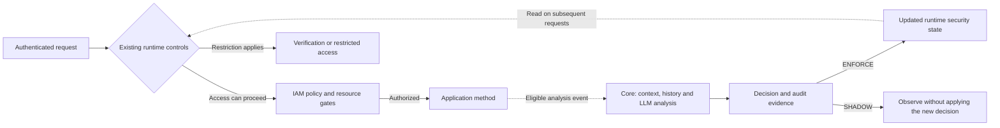

<p align="center">
  
</p>

<p align="center">
  <strong>Open-source AI-native Post-Authentication Runtime Control Plane</strong>
</p>

<p align="center">
  <a href="LICENSE"></a>
  <a href="https://openjdk.org/"></a>
  <a href="https://spring.io/projects/spring-boot"></a>
</p>

> **Security does not end at login.**

Contexa brings AI-based security decisions into your Spring Boot application **after authentication**. It combines the authenticated identity, requested resource, available business context, and recent activity to assess whether access still makes sense. The application can then require additional verification, restrict access, or allow work to continue.

Your login establishes who is making a request. Your authorization policy establishes what they may access. Contexa adds runtime evaluation of **what that authenticated identity is doing in context**.

**[Try the demo](https://demo.ctxa.ai)** · **[Get started](#get-started)** · [Documentation](https://docs.ctxa.ai) · [Examples](#examples) · [Website](https://ctxa.ai)

## See the value

Consider an employee who is allowed to read settlement documents. A valid login and the correct role remain the same across these situations:

| Available context | What Contexa evaluates | Possible response |
|---|---|---|
| Reads records relevant to an assigned settlement task | Whether access fits the task and recent activity | Continue the work |
| The same identity starts accessing unrelated customer records | Whether the stated purpose and actual behavior are consistent | Require additional verification |
| Activity provides evidence of continued misuse | Whether access should remain available | Restrict access and record the reason |

This example illustrates how the same permission can lead to different runtime responses. Contexa selects an action using the supplied context, configured policies, model analysis, and operating mode.

The [demo](https://demo.ctxa.ai) connects each stage of runtime security: **perform a task → inspect the decision and its evidence → observe access control → complete verification or recovery → return to authorized work**.

## Get started

Add Contexa to an **existing Spring Boot application** using the steps below. The [demo](https://demo.ctxa.ai) provides a guided product experience, and the [example applications](#examples) show common integration scenarios.

**Requirements:** Java 17+, Spring Boot 3.5.x, and a Maven or Gradle project. AI analysis also needs a configured Contexa database and chat/embedding models. Use PostgreSQL with pgvector for the PostgreSQL vector-store setup. Ollama provides a local model option; cloud providers need their own credentials. Docker is needed only when provisioning containerized infrastructure.

**Version:** `0.1.0`. Contexa supports Spring Boot 3.x; Spring Boot 4.x is not supported.

### 1. Configure your application

Install the [Contexa CLI](https://github.com/contexa-security/contexa-cli), which guides dependency and configuration setup.

Linux / macOS:

```bash
curl -fsSL https://install.ctxa.ai/install.sh | sh
```

Windows PowerShell:

```powershell
irm https://install.ctxa.ai/install.ps1 | iex
```

Open a new terminal if needed, then run these commands from the directory containing your application's `pom.xml` or `build.gradle`:

```bash
contexa --version
contexa init
```

Enable AI security in the guided setup and select a model provider. Configure host-owned integration with `SANDBOX` and begin observing decisions in `SHADOW` mode, as shown below.

The application uses the Contexa starter dependency. For Gradle:

```gradle
dependencies {
    implementation "ai.ctxa:spring-boot-starter-contexa:0.1.0"
}
```

For Maven, use the equivalent dependency:

```xml
<dependency>
    <groupId>ai.ctxa</groupId>
    <artifactId>spring-boot-starter-contexa</artifactId>
    <version>0.1.0</version>
</dependency>
```

Configure the selected provider's Spring AI dependencies, chat model, and embedding model using the [installation guide](https://docs.ctxa.ai/en/get-started.html) and [AI configuration](https://docs.ctxa.ai/en/docs/install/configuration/ai.html). For Ollama, install both configured models before starting the application.

In your existing main application class, enable host-owned integration:

```java
import io.contexa.contexacommon.annotation.EnableAISecurity;
import io.contexa.contexacommon.security.bridge.SecurityMode;
import org.springframework.boot.SpringApplication;
import org.springframework.boot.autoconfigure.SpringBootApplication;

@SpringBootApplication
@EnableAISecurity(mode = SecurityMode.SANDBOX)
public class MyApplication {
    public static void main(String[] args) {
        SpringApplication.run(MyApplication.class, args);
    }
}
```

`SANDBOX` keeps authentication and IAM ownership with the host application. The separate `SHADOW` setting enables AI analysis and records decisions without applying new AI-driven access restrictions. Configure both the runtime mode and Contexa database in the application's active configuration:

```yaml
contexa:
  security:
    zerotrust:
      mode: SHADOW
  infrastructure:
    mode: standalone
  datasource:
    url: ${CONTEXA_DB_URL}
    username: ${CONTEXA_DB_USERNAME}
    password: ${CONTEXA_DB_PASSWORD}
```

Set `CONTEXA_DB_URL`, `CONTEXA_DB_USERNAME`, and `CONTEXA_DB_PASSWORD` in the environment used to launch the application. Configure the Contexa datasource alongside your host application's datasource using the [configuration guide](https://docs.ctxa.ai/en/docs/install/configuration.html). Load a separate Contexa configuration file through the application's active profile or configuration import.

### 2. Protect a resource

Add `@Protectable` to a Spring-managed method. This small read-only endpoint gives you a concrete first request; place it under your application's component-scan package:

```java
import io.contexa.contexacommon.annotation.Protectable;
import org.springframework.web.bind.annotation.GetMapping;
import org.springframework.web.bind.annotation.RestController;

@RestController
public class RuntimeSecurityExampleController {
    @Protectable
    @GetMapping("/api/runtime-security/example")
    public String readExample() {
        return "Example resource reached";
    }
}
```

Use your application's existing login and authorize this resource through the applicable host/Contexa policy integration. `@Protectable` connects authenticated resource access to Contexa's runtime evaluation. See [resource protection and policy setup](https://docs.ctxa.ai/en/docs/reference/iam/protectable.html) and [legacy integration](https://github.com/contexa73/contexa-examples/tree/master/contexa-example-legacy-system).

### 3. Run and observe the first decision

From your application's project directory, start the server:

| Build tool | Linux / macOS | Windows PowerShell |
|---|---|---|
| Gradle | `./gradlew bootRun` | `.\gradlew.bat bootRun` |
| Maven | `./mvnw spring-boot:run` | `.\mvnw.cmd spring-boot:run` |

Log in through your existing application, then visit `/api/runtime-security/example` on its configured address, for example `http://localhost:8080/api/runtime-security/example`. For a token-based API, send the request through your existing authenticated client.

Check both parts of the result:

- **Application:** an authorized request reaches the method and returns `Example resource reached`.
- **Analysis:** wait for asynchronous processing and inspect the decision in the security audit output. At INFO level, the default enforcement handler logs `[SecurityDecisionEnforcementHandler][SHADOW] Observation-only`, including the observed action. This confirms observation without applying that new decision to runtime access.

The application response shows the resource-access result. The audit output shows the analysis result and identifies whether it came from a model decision or a technical fallback. Inspect both to follow the request through the full security flow.

Review decisions and explanations for your application's business scenarios in `SHADOW`. Enable `ENFORCE` to apply runtime controls after configuring resource quality checks, authorization policies, and verification/recovery flows. See the [Shadow mode guide](https://docs.ctxa.ai/en/docs/install/shadow-mode.html).

## How analysis becomes runtime control

The default `@Protectable` path is **asynchronous**. Existing authentication, authorization, and applicable runtime controls govern the request; eligible resource invocations emit an event for new AI analysis. In `ENFORCE`, the resulting state can affect subsequent requests.



**Choose when a new decision takes effect:** asynchronous analysis updates controls for subsequent requests. For a resource that requires a fresh decision before execution, use `@Protectable(sync = true)`; in `ENFORCE`, a non-ALLOW result prevents method execution. Synchronous requests include model analysis time in their response latency.

`@Protectable(verificationRequired = true)` enables the resource prompt-quality gate by default. Setting it to `false` permits analysis regardless of the resource's quality-verification state. In `SHADOW`, unmet quality requirements are recorded without enforcing the access restriction. **Resource prompt-quality verification and user MFA are separate processes.**

| Decision | Meaning when enforcement is enabled |
|---|---|
| `ALLOW` | Continue subject to the application's authorization checks |
| `CHALLENGE` | Require additional identity verification through the configured flow |
| `BLOCK` | Restrict access; recovery depends on the configured policy |
| `ESCALATE` | Route the case into the configured escalation or review flow |
| `PENDING_ANALYSIS` | Keep access pending while analysis or required review is unresolved |

Browser flows use verification or restriction pages, while APIs receive the corresponding HTTP response. With `ALLOW`, the application continues processing and produces its normal response.

## Choose the right modes

These are three independent choices:

| Choice | Options | What it controls |
|---|---|---|
| Security ownership | `SANDBOX` / `FULL` | Host-owned integration or Contexa-managed identity/IAM; see [integration guidance](https://docs.ctxa.ai/en/get-started.html) for ownership overrides |
| AI runtime control | `SHADOW` / `ENFORCE` | Observe decisions or apply runtime controls |
| Infrastructure | `standalone` / `distributed` | In-process event/state handling or Redis/Kafka-backed distributed handling |

Both infrastructure modes use the database and model services required by the enabled features. Choose Ollama or a cloud model provider independently of the infrastructure mode. `standalone` keeps runtime state in memory for the application's lifetime; `distributed` uses Redis and Kafka for shared state and event processing. See [infrastructure configuration](https://docs.ctxa.ai/en/docs/install/configuration/infrastructure.html).

## Examples

Choose an example by the behavior you want to explore and follow its Java, database, and model setup instructions.

| Example | What to learn |
|---|---|
| [Quickstart](https://github.com/contexa73/contexa-examples/tree/master/contexa-example-quickstart) | Basic integration and observation in Shadow mode |
| [Resource protection](https://github.com/contexa73/contexa-examples/tree/master/contexa-example-protectable) | Method protection and the context-to-decision pipeline |
| [Identity and MFA](https://github.com/contexa73/contexa-examples/tree/master/contexa-example-identity-mfa) | Authentication, passkeys, and additional verification |
| [Legacy integration](https://github.com/contexa73/contexa-examples/tree/master/contexa-example-legacy-system) | Connect an existing application's identity and security context |

The [Examples Guide](https://docs.ctxa.ai/en/docs/install/examples.html) explains the scenarios and setup requirements.

## Architecture

Contexa integrates authentication, authorization, AI analysis, and runtime enforcement through these modules:

| Module | Responsibility |
|---|---|
| `contexa-identity` | Authentication flows, MFA/passkeys, and runtime access-control filters |
| `contexa-iam` | URL/method authorization, resource policies, and `@Protectable` interception |
| `contexa-core` | Context processing, retrieval, LLM orchestration, decisions, audit, and runtime state |
| `contexa-common` | Shared annotations, security context, DTOs, and integration contracts |
| `contexa-autoconfigure` | Spring Boot configuration and component wiring |
| `spring-boot-starter-contexa` | Dependency entry point for application integration |

Read the [architecture overview](https://docs.ctxa.ai/en/docs/reference/architecture/overview.html) and [runtime flow](https://docs.ctxa.ai/en/docs/reference/architecture/zero-trust-flow.html) for the module connections and control lifecycle.

The open-source modules provide the runtime control foundation. Commercial and enterprise operational features are delivered separately. Contexa complements authentication, authorization, and broader security tooling with context-aware control inside the application.

## Project and community

Contexa **`0.1.0`** is an open-source platform licensed under Apache 2.0. Explore the documentation and benchmarks, share integration experiences, and contribute to the project.

- **Learn:** [Documentation](https://docs.ctxa.ai), [public benchmarks](https://ctxa.ai/benchmark), [website](https://ctxa.ai).
- **Contribute:** [Contributing guide](CONTRIBUTING.md), [issues](https://github.com/contexa-security/contexa/issues), [maintainers](MAINTAINERS.md), [governance](GOVERNANCE.md).
- **Report security issues:** follow [SECURITY.md](SECURITY.md) or the [security contact](https://ctxa.ai/.well-known/security.txt).
- **Release history:** [Changelog](CHANGELOG.md), [release notes](RELEASE_NOTES.md).
- **License:** [Apache License 2.0](LICENSE).
