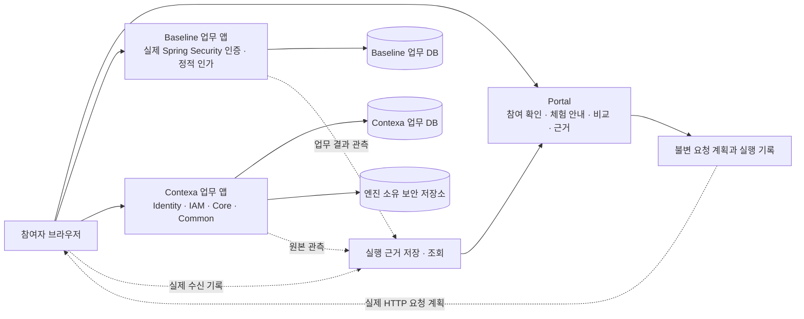
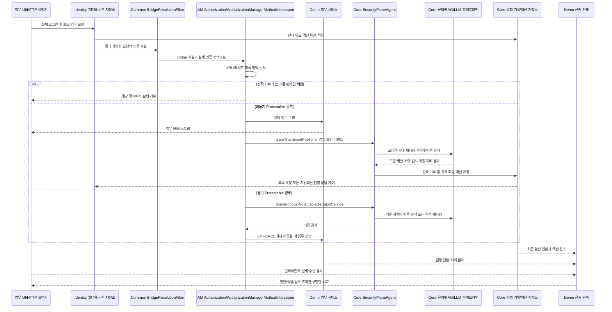

# Contexa Runtime Lab — 최종 통합 설계 및 구현 백로그

작성일: 2026-09-23  
문서 상태: 종합 통합 재설계안 — 목적·중복·필수성 재판단 반영. 구현·실서버 검수·공개 완료를 뜻하지 않는다.  
대상: OSS `contexa/contexa-demo`. Enterprise 데모는 분석·참고 대상이며 실행 의존성이 아니다.

## 1. 무엇을 만들 것인가

**정상 로그인한 사용자가 실제 업무를 수행하다가 활동 조건이 바뀌었을 때, Contexa가 애플리케이션 안에서 무엇을 근거로 판단하고 업무를 어떻게 제어하는지 직접 경험하는 데모 솔루션을 만든다.**

첫 체험의 중심은 환경 설정이나 보안 분석 콘솔이 아니다. 사용자는 문서를 열고, 고객 자료를 내보내고, 승인된 예외 업무를 수행한다. 같은 계정과 정적 권한에서도 Contexa가 활동 문맥을 판단한다는 것을 실제 업무 결과와 비교 화면으로 이해한다. 상세 근거와 반복 평가는 그 경험을 뒷받침한다.

참여자가 체험을 마치며 이해해야 할 내용은 다음 다섯 가지다.

1. 로그인 성공은 사용자의 현재 모든 활동이 정당하다는 보장이 아니다.
2. 정적 권한과 현재 업무의 목적·담당 범위·승인·행동 이력은 서로 다른 근거다.
3. Contexa는 인증 이후의 활동을 판단하고 애플리케이션의 실제 요청·응답을 제어한다.
4. 정상 업무 유지, 추가 확인, 차단, 검토와 분석 대기는 서로 다른 결과다.
5. 화면의 설명은 실제 판단·집행·업무 결과에서 확인할 수 있다. 판단 시점과 통제 시점도 구별된다.

이 다섯 가지를 모든 참여자가 이해하도록 안내·직접 조작·비교·복귀 동선을 설계한다. 모든 방문자의 이해도를 이미 입증했다거나, Contexa가 시장에서 유일하다고 주장하지 않는다. 사용자 검증은 별도의 실제 참여자 기록으로 판정한다.

**간결한 동선과 전문적인 완성도는 동시에 필수다.** 단조로운 카드 나열, 설명문과 결과 배지만 있는 화면, 작동하지 않는 버튼, 근거 없는 차트, 미완성 오류 화면으로 완료 처리하지 않는다.

## 2. 통합한 기준과 현재 상태

### 2.1 문서의 관계

| 기존 문서 | 유지하는 내용 | 현재 설계에서 정정하는 내용 |
|---|---|---|
| [09-19-02 백로그·완료 기준](./2026-09-19-02-contexa-runtime-lab-구현-백로그-및-완료-판정-기준.md) | 원본 요구·S01~09·검증 이력과 실서버 완료 원칙 | 30개를 새 9개 책임으로 통합. 공개 필수 기능과 별도 통계 연구 PERF-01의 적용 범위를 이유와 함께 분리 |
| [09-19-03 진행·증거 대장](./2026-09-19-03-contexa-runtime-lab-구현-진행-및-증거-대장.md) | 실패·수정·승인·실행 이력 전부 | 최신 소스와 맞지 않는 과거 상태를 현재 사실로 사용하지 않음. 문서 앞부분보다 후속 정정 기록을 우선 |
| [09-20-15 Phase A 구현·검증](./2026-09-20-15-contexa-runtime-lab-Phase-A-구현-검증.md) | 당시 실제 확인한 범위와 미검증 범위 | 당시 빌드·기동 결과를 현재 코드의 통과 증거로 승계하지 않음 |
| [09-20-16 Phase A 재전개](./2026-09-20-16-contexa-runtime-lab-Phase-A-재전개-및-완료-판정.md) | 원본 A 조건 20개와 승인된 기반/실제 연결 분리 원칙 | 뒤에 승인된 내용을 앞의 ‘승인 대기’ 문구보다 우선. 인증 재구현 지시는 후속 사용자 정정에 따라 폐기 |
| [09-20-16 재검토·재사용 설계](./2026-09-20-16-contexa-runtime-lab-구현계획-재검토-및-재사용-설계.md) | 이메일 진입, 출처·소유권, 업무→비교→근거, 기존 자산의 책임별 재사용 | 이미 구현된 이메일 진입 등을 계속 미구현으로 적지 않음. 기존 UI 이식 자체를 완성도로 인정하지 않음 |

본 문서는 위 문서의 설계 내용을 통합한다. 기존 문서는 이력으로 보존한다. 세부 원본 완료 문구는 [원본 완료조건 추적표](./2026-09-23-03-contexa-runtime-lab-원본-완료조건-추적표.md)에 함께 보존한다. 이번 최신 재설계 요청에 따라 기능의 필요성·통합·이관을 새로 판단했다. 과거 30개 전체를 자동으로 현행 필수 범위에 승계하지 않으며, 필요 기능을 숫자 축소 목적으로 삭제하지 않는다. 제품 수정이나 Phase 전환을 실행한 것은 아니다.

### 2.2 실제 소스에서 확인한 출발점

- 현재 OSS `PlatformSecurityConfig`는 주입된 `IdentityDslRegistry`, IAM 인가 관리자, `AISessionSecurityContextRepository`, form/MFA/passkey/OTT 구성을 사용한다. 현재 소스 전체를 자체 보안 엔진이라고 단정하지 않는다.
- 과거 자체 baseline MFA·Passkey 화면/JS 구현은 후속 이력에서 제거됐다. 현재 `LabAuthenticationHandler`에는 성공·실패 응답과 로그인 실패 페이지 구성에 개입하는 코드가 남아 있다. 관측 책임으로 축소하고 원래 응답 소유자에게 돌려야 할 대상이다.
- 이메일 참여 확인, 시나리오 선언, 진단, 기본 마이그레이션, UI 공통 구조는 존재한다. 이들은 적절한 데모 책임이며 일괄 폐기하지 않는다.
- 현재 `compare.js`, `evidence.js`는 빈 화면이고 `ReadinessService`는 실행기를 `NOT_IMPLEMENTED`로 표시한다. 실제 업무·비교·모델 관측·집행 효과 체험은 구현된 것으로 볼 수 없다.
- 기존 기록의 Phase A 미완료·0/30은 이력으로 보존한다. 새 9개 작업 묶음도 완료 증거가 없으며 0/9다. 이번에는 테스트·빌드·서버 기동·DB 변경을 하지 않았으므로 현재 서버 상태나 새로운 통과 판정을 주장하지 않는다.

상세 클래스·프론트 분석과 재사용 판단은 [기존 데모 분석·재사용 대장](./2026-09-23-02-contexa-runtime-lab-기존-데모-분석-및-재사용-대장.md)을 따른다. SaaS 구현은 분석 범위에 포함하지 않았다.

### 2.3 통합 판단 원칙과 결정

각 원본 항목은 ①사용자에게 필요한 경험, ②엔진의 올바른 사용, ③결과의 진실성과 재현, ④공개 운영의 필수성, ⑤다른 항목과의 중복을 기준으로 판단했다. 구현량이나 기존 번호의 개수를 목표로 삼지 않는다.

| 판단 | 실제 적용 | 이유·영향 |
|---|---|---|
| 통합·유지 | 프로젝트 문서·고객·승인, 실제 인증/학습/비교/근거/Passkey, UI, 격리·비용·설치 | 같은 목표를 여러 ID가 나눠 가졌으므로 책임별로 통합. 기능과 필요한 검증은 유지 |
| 분리 | 대규모 보류군·통계·모델/버전 평가를 PERF-01로 배치 | 기능 체험과 일반화 성능 연구는 다른 납품. 실제 반복 실행·실패 보존·효과 측정은 첫 공개에 유지하고 정량 주장에는 연구 완료를 요구 |
| 폐기 | 직접 인증 객체 생성, 자체 MFA/session, 합성 ALLOW 학습, 위험 미리보기 판정, HTTP 상태 기반 AI 액션, 가짜 완료/총량, 액션 삭제식 복구 | 엔진 사용과 실제 체험이라는 목적을 훼손하는 구현 방식. 그 코드가 제공하던 필요한 체험은 엔진의 정상 경로로 대체 |
| 보강 | 관측 가능성/실패 격리, 근거 전체의 소유·민감정보 보호, 수신 측정 출처, 대표 체험의 실제 효과 | 기존 항목명만으로는 빠지기 쉬우며 확인된 소스 경계와 공개 체험의 신뢰에 직접 필요. 12절 ADD-01~05로 추적 |

원본 107개 완료 문장은 추적표에 남기고 새 책임·범위·판단 이유를 연결한다. 남겨 둔 원문이 모두 현재 공개 게이트라는 뜻은 아니며, 이관한 조건을 완료로 처리하지도 않는다. 정당한 이유로 전부 폐기할 수 있는 사용자 기능은 발견하지 못했으므로 기능을 억지로 없애지 않았다.

## 3. 엔터프라이즈 데모의 한계와 새 데모의 차이

엔터프라이즈 데모는 Contexa DSL, `@Protectable`, 분석 이벤트 observer, baseline/vector 서비스, 액션 저장소를 실제 사용한다. 이 통합 방향은 참고할 가치가 있다. 다만 통합 사실만으로 새로운 데모의 목적까지 충족하지는 않는다.

| 엔터프라이즈에서 확인한 구조 | 체험·입증의 한계 | 새 설계 |
|---|---|---|
| 페르소나 배정과 `SecurityContext` 전환 | 실제 두 환경 로그인·초기 인증 동등성의 증거가 아님 | 두 arm에서 실제 인증 엔드포인트 사용, 계정·역할·정적 정책·초기 인증 수준 대조 |
| `LearningCycleService`가 생성한 ALLOW를 학습 서비스에 전달 | 실제 업무 요청→판단→학습을 경험하기 어려움 | 실제 정상 업무 HTTP에서 엔진이 허용한 학습만 관측 |
| 정상 SELF와 ATTACK의 판단 비교 | Contexa 유무에 따른 실제 업무 결과 비교가 아님 | 동일 업무 앱의 baseline/Contexa arm 비교 + 정상/변경 조건 비교 |
| 문자열 반환·생성 데이터 중심 테스트 서비스 | 실제 담당 범위·승인·문서·고객 업무의 의미가 약함 | 실제 DB 원본과 업무 처리, 파일·부분 수신까지 확인 |
| 데모의 유사도 가중치·공격 난이도·예상 액션 | 엔진 판단과 데모 예측을 혼동하기 쉬움 | 입력 사실의 차이만 미리 표시. 위험 판단과 액션은 엔진 결과만 표시 |
| 사용자 최근 SSE·최근 액션 중심 결과 조합 | 요청별 신규 판단과 이전 판단 적용의 구분에 한계 | 요청/분석 세대/시도/최종 결정/집행 원본을 명시적으로 연결 |
| 외부 공식 검증 호스트의 프롬프트 품질 결과 | OSS 독립 실행 및 업무 통제 효과 입증을 대체하지 못함 | OSS 자체 실행 증거와 사전 평가 기준으로 평가. 별도 보안 판단 엔진은 만들지 않음 |
| guided 화면이 숨겨진 wizard DOM을 클릭·감시 | 화면 텍스트·타이머와 실제 완료 상태가 결합 | 단일 화면 상태 모델이 서버의 실행 상태를 구독 |

이는 재설계의 이유이지, 위 클래스들을 모두 치명적인 제품 결함으로 판정한 목록이 아니다. 기존 Contexa의 정상 비동기 처리·액션 재사용·MFA 계약을 데모에 맞추어 변경하지 않는다.

## 4. 제품의 사용자 경험

### 4.1 첫 체험: 하나의 짧고 완결된 이야기

| 단계 | 사용자가 하는 일 | 화면에서 확인할 실제 사실 |
|---|---|---|
| 시작 | 이메일을 확인하고 체험 공간에 진입 | 참여 확인과 업무 로그인이 별개임을 짧게 안내 |
| 로그인 | 두 환경의 실제 업무 계정으로 로그인 | 같은 업무 인물·역할·정적 권한·초기 인증 수준. 환경별 세션은 분리 |
| 정상 업무 | 담당 프로젝트 문서를 열고 필요한 자료를 내려받음 | 업무 결과, 실제 요청 이력, Contexa의 관측 상태 |
| 조건 변경 | 안내된 다른 범위의 자료를 열거나 내보내기를 실행 | 로그인·정적 권한은 그대로이고 바뀐 업무 조건만 표시 |
| 차이 확인 | 두 환경의 실제 처리 결과를 비교 | 받은 자료, 제한된 후속 업무, 판단·실효 통제 시점 |
| 이유 확인 | 주요 근거를 펼치고 필요한 경우 추가 인증·정상 복귀 | 담당 범위/승인/실제 이력/검색 근거와 엔진 결과의 연결 |

빠른 체험의 기본 이야기에는 정상 업무와 위험 조건 변화가 함께 있어야 한다. 승인된 대량 처리·정당한 예외를 이어서 선택할 수 있어야 한다. ‘다르면 차단한다’는 학습으로 끝나지 않는다.

원하는 액션이 나오도록 재시도하거나 결과를 교체하지 않는다. Contexa가 허용했거나 통제가 늦었거나 기술적으로 실패했다면 그 결과를 표시한다. 설명 문구도 해당 실행의 실제 사실에서 구성한다.

### 4.2 화면 구성

주 탐색은 **업무 공간 / 보안 비교 / 실행 근거**로 유지한다. 환경 진단·평가 운영은 보조 화면으로 둔다.

| 화면 | 구체적인 구성과 주 행동 | 피해야 할 결과 |
|---|---|---|
| 체험 시작 | 짧은 가치 설명, 이메일 단계, 준비 여부, 단일 시작 버튼 | 긴 아키텍처 강의·내부 설정 폼이 첫 화면을 차지 |
| 업무 공간 | 프로젝트 탐색, 검색 가능한 문서 목록, 미리보기, 고객 테이블, 선택·내보내기, 승인 상세/이력 | 서로 같은 카드에 이름만 바꾼 가짜 업무 |
| 조건 변경 패널 | 승인·목적·담당 범위·대상·속도 중 해당 사례의 변경 항목, 고정 조건 비교 | 위험 점수·기대 액션 슬라이더, 인증/MFA 사실 편집 |
| 실행 중 | 양쪽 업무 처리 상태, 실제 수신량, 관측된 단계와 경과 시간, 취소 | 시간만으로 95%까지 채우는 분석 진행률 |
| 비교 결과 | 동일 시작 조건, 실제 업무 결과의 좌우 비교, 통제 시점 표시, ‘왜 이런 결과인가’ | BLOCK 배지만으로 유출 0건·안전 성공을 선언 |
| 근거 상세 | 업무 사실→baseline/RAG→실제 입력→모델 응답→최종 결정→적용 결과를 선택해 탐색 | 첫 화면 전체 JSON, 서로 다른 요청의 숫자 혼합 |
| 추가 확인/차단 | 엔진이 제공하는 다음 경로, 업무 영향, 포털 증거 보기, 정당한 복구 상태 | 별도 Passkey 구현, 임의 ‘차단 해제’ 버튼 |
| 결과 회고 | 바뀐 조건, 실제 결과, 확인한 근거를 짧게 정리하고 다른 조건 체험 제공 | 클릭 완료를 플랫폼 이해 완료로 집계 |

입문자는 자연어 요약과 실제 결과부터 본다. 개발자는 같은 화면에서 원본 ID, 클래스 경로, 설정과 프롬프트를 더 펼친다. 서로 다른 두 실행 화면을 복제해 유지하지 않는다.

### 4.3 시각·상호작용 완성도 계약

- 밝은 중립 배경, 한 가지 주 브랜드 색, 의미가 일관된 상태 색을 사용한다. 문서·데이터·비교·근거 화면은 정보 목적에 맞는 서로 다른 구성을 가진다.
- 4/8 간격 체계, 명확한 제목·본문·보조 정보 위계, 숫자 정렬, 일관된 아이콘·테이블·폼·배너·드로어·대화상자를 공통 컴포넌트로 관리한다.
- 기본·빈 상태·로딩·실행 중·부분 수신·분석 대기·추가 인증·차단·실패·취소·만료·복귀 상태의 문구와 주 행동을 화면별로 정의한다.
- 로딩 중 조작 중복을 막되 실패 시 재시도와 뒤로 가기를 제공한다. 재시도는 새 실행인지 같은 명령의 재전송인지 명확해야 한다.
- 화면 이동·SSE 갱신·정렬 후 선택과 키보드 포커스를 보존한다. 드로어/대화상자는 포커스 진입·복귀, Escape, 배경 조작 제한을 검수한다.
- 1440/1280 업무·비교, 768/390 결과·근거, 200% 확대, 키보드 전 과정, reduced-motion, 한국어/영어, Google Chrome을 검수한다. (2026-09-27 사용자 지시로 브라우저 범위를 Chrome으로 변경했다.) 대비는 기존 명세의 AA 수준 수치로 측정하되 인증 취득이라고 표현하지 않는다.
- 기본 조작은 즉시 눌림/진행 상태로 반응한다. 모델 대기 시간과 UI 자체 지연을 따로 기록한다. 긴 대기는 현재 확인된 단계·경과 시간·중단/복귀 방법을 제공한다.
- CSS 존재나 가로 넘침 없음만으로 전문성을 통과시키지 않는다. 실제 업무 화면·실행 결과·실패와 복귀를 포함한 검수 자료가 필요하다.
- Contexa 기본 인증 화면과 SDK는 그대로 사용한다. 지원되는 공식 설정·테마 범위에서 전체 경험을 정돈하며, 고급 UI 요구를 인증 화면/프로토콜 재구현의 근거로 사용하지 않는다.

## 5. 아키텍처와 소유 책임

### 5.1 엔진과 데모의 경계

| 책임 | 소유자 | 데모가 할 수 있는 일 |
|---|---|---|
| 인증, 인증 화면/SDK, MFA 상태, Passkey/OTT, 세션·토큰 | contexa-identity | 기존 DSL 설정, 실제 인증 사용, 읽기 관측, 엔진이 정한 복귀 경로 연결 |
| 정책·역할·자원·정적 인가, `@Protectable` 인터셉터 | contexa-iam | 업무의 정책·자원 정의와 공식 설정/서비스 사용 |
| 인증/인가/위임 stamp, bridge, 공통 이벤트·감사 계약 | contexa-common | 서버가 확인한 업무 사실 연결, 원본 식별자 보존 |
| 문맥·baseline·RAG·프롬프트·LLM·최종 결정·액션·학습 | contexa-core | 공식 확장점으로 업무 원본 제공, 기존 원본 읽기, 변경 없는 관측 |
| 문서·고객·프로젝트·승인 업무 | contexa-demo | 실제 업무 서비스/DB/화면 구현 |
| 참여자·실험 계획·비교 요청·근거 보관·평가·보고 | contexa-demo | 체험 운영과 사후 평가. 업무 보안 판단이나 액션 변경 권한 없음 |

데모 내부에는 위험 점수 계산기, 자체 ALLOW/BLOCK 판정기, 대체 프롬프트/모델 호출 경로, 별도 MFA 상태 머신, 액션 TTL 관리자, 생성 ALLOW 학습기, 보안 컨텍스트 강제 교체기를 두지 않는다.

`Run`의 준비·실행·중단 상태는 체험 작업 상태다. 이것이 엔진의 `PENDING_ANALYSIS`, `CHALLENGE`, `ESCALATE`를 대체해서는 안 된다. 사후 `Evaluation`도 보고서 판정이며 런타임 액션을 쓰지 않는다.

### 5.2 배치 구조

동일 OSS 데모 앱을 세 역할로 실행한다. 로컬 기본 포트는 portal 18080, baseline 18081, contexa 18082다.

- baseline은 AI를 비활성화한 정적 보안 대조군이다. SHADOW를 baseline으로 사용하지 않는다.
- Contexa arm은 FULL 통합과 실제 ENFORCE를 사용한다. 활성 설정뿐 아니라 실제 체인을 증거로 남긴다.
- 업무 코드·입력 검증·데이터 seed·공통 정적 정책은 공유한다. Contexa arm의 추가 IAM 경로와 체인 차이는 공개한다. 일부 룰 문자열의 해시만으로 전체 동등성을 주장하지 않는다.
- 포털의 방문자 소유권과 업무 인증을 분리한다. 업무 계정이 제한돼도 자기 결과와 근거는 포털에서 볼 수 있다.
- 공개 배포는 고정 크기 슬롯을 독점 임대한다. 슬롯별 엔진 상태·업무 DB·계정·Passkey·이력·파일을 분리한다. 상세 운영은 Phase D의 책임이다.

### 5.3 실제 요청부터 종료까지

위 도식은 책임 흐름이다. 모든 물리 필터의 전후 순서를 나타낸 도식이 아니며, 기존 런타임 필터에서 차단된 요청은 IAM/업무까지 도달하지 않을 수 있다. 실제 체인 순서는 실행한 프로필에서 별도 기록한다.

### 5.4 핵심 클래스 연결

| 구간 | 실제 엔진 클래스 | 데모 적용 |
|---|---|---|
| 부트스트랩 | `EnableAISecurity`, `AiSecurityImportSelector`, `AiSecurityConfiguration`, `IdentityDslRegistry`, `SecurityPlatformInitializer`, `SecurityFilterChainRegistrar` | 새 DSL/adapter registry 제작 없이 `PlatformSecurityConfig`로 구성 |
| 초기 인증·상태 | form adapter/configurer, `AISessionSecurityContextRepository`, `MfaStateMachineIntegrator`, `MfaSessionRepository`, factor 처리 핸들러 | 기본 화면·SDK·저장소·최종 완료 계약 사용. form 중간 성공을 MFA 완료로 보지 않음 |
| bridge | `BridgeResolutionFilter`, `AuthenticationStamp`, `AuthorizationStamp`, `BridgeResolutionResult` | 실제 인증·인가 출처 보존. 방문자 헤더를 인증 사실로 승격하지 않음 |
| 정적·메서드 인가 | `CustomDynamicAuthorizationManager`, `DatabasePolicyRetrievalPoint`, `AuthorizationManagerMethodInterceptor`, `ProtectableMethodAuthorizationManager` | 실제 정책/자원으로 연결. 정적 거부는 AI 탐지 성과에서 제외 |
| 보안 이벤트 | `ZeroTrustEventPublisher`, `ZeroTrustEventListener`, `SecurityMonitoringService`, `SecurityPlaneAgent`, `SecurityEventProcessor` | 업무 요청에서 기존 경로로 유입. 실행기가 에이전트를 직접 호출하지 않음 |
| 분석 | `ColdPathEventProcessor`, `DefaultCanonicalSecurityContextProvider`, `BaselineLearningService`, `UnifiedVectorService`, `PromptContextAuthorizationService` | 실제 업무 사실·학습 이력·인가된 검색 결과 사용 |
| 프롬프트·모델 | `AbstractTieredStrategy`, `PipelineOrchestrator`, `UniversalPipelineExecutor`, `PromptEvidenceComposer`, `UnifiedLLMOrchestrator` | 기존 파이프라인 사용. 데모 프롬프트·판정용 LLM 추가 금지 |
| 최종 기록·집행 | `SecurityDecisionEnforcementHandler`, `AiSecurityDecisionObservationWriter`, `ZeroTrustActionRepository`, `BlockingSignalBroadcaster` | 모델 제안, 저장된 최종 결정, 현재 적용을 별도 표시 |
| 요청 제어·추가 인증 | `ZeroTrustAccessControlFilter`, `ZeroTrustChallengeFilter`, `ChallengeMfaInitializer`, `BlockableResponseWrapper` | 실제 제한/추가 인증/스트림 결과 관측. 임의 상태 전이 금지 |
| 복구·종료 | `BlockedUserService`, `AdminOverrideService`, `ZeroTrustUnblockController`, 기존 logout/zero-trust cleanup | 권한 있는 정상 복구 경로 사용. 로그아웃·새 실험으로 BLOCK을 우회하지 않음 |

문서에 남은 HCAD 조기 탐지 설명을 현재 존재하지 않는 `HCADFilter` 구현으로 가정하지 않는다. L1→L2는 현재 코드의 ESCALATE 처리 계약을 따른다. PENDING을 항상 HTTP 503으로, BLOCK을 세션 자동 무효화로, L2 SOAR 계획을 외부 실행 완료로 표현하지 않는다.

## 6. 엔진 연결의 구체적인 구현 경계

### 6.1 인증과 실제 HTTP 실행

초기 비교 인증은 현재 후속 정정의 form 기반 동등 구성을 기준으로 한다. baseline에 별도 MFA 엔진을 만들지 않는다. Contexa의 runtime CHALLENGE를 위한 MFA/passkey/OTT 체인은 유지한다. 초기 인증 완료와 런타임 추가 확인을 각각 실증한다.

`LabAuthenticationHandler`를 확장해 응답·리다이렉트·MFA 성공 여부를 해결하지 않는다. 기존 Identity/Spring 핸들러와 공식 URL 설정이 응답을 소유한다. 인증 관측은 실제 완료 이벤트와 최종 HTTP 경계에서 수집하며 관측 실패가 인증 결과를 변경하지 않는다.

대화형 비교는 브라우저의 실제 arm 세션과 arm별 CSRF를 이용한다. 기존 인증 화면은 해당 arm origin에서 최상위 탐색으로 연다. 인증 후 포털은 실제 identity 조회로 상태를 다시 확인한다. 복귀 알림이나 UI 플래그를 인증 성공으로 신뢰하지 않는다. 자동 반복도 동일 HTTP 계약을 사용하고 브라우저 직접 조작과 자동 발행을 기록에서 구별한다.

origin 간 요청이 필요한 배치는 허용된 portal origin만 CORS에 등록하고 credentials·CSRF를 검증한다. `*` 허용, 프록시에서의 임의 로그인 응답 재작성, 세션 원문을 URL/localStorage/보고서로 전달하는 방식은 사용하지 않는다. 공개 origin/RP/쿠키/참여 자격 전달은 A의 배치 계약에서 확정하고 D에서 실제 배포 검증한다. 참여 자격 전달은 업무 인증을 발급하지 않는다.

### 6.2 업무 사실 제공

- 문서·고객·승인 DB는 데모 업무의 원본이다. 보호 서비스 호출 전에 현재 요청과 관련된 원본 ID·버전·관측 시각을 확정한다.
- `ResourceContextRegistry`/`ResourceContextDescriptor`에는 실제 업무 자원의 유형·민감도·허용 역할/행동 정보를 연결한다. IAM 자원 registry와 다른 책임임을 유지한다.
- `OrganizationContextProvider` 등 기존 `ContextEnricher` 계열에는 실제 소속·담당 업무 사실을, `FrictionContextProvider`에는 실제 승인 상태·승인 이력을 연결한다. 인증·정적 인가를 데모 provider가 추정하거나 재판정하지 않는다.
- `RequestInfoExtractor`가 읽는 요청 속성을 사용할 때도 값은 신뢰할 수 있는 서버 업무 조회에서만 채운다. 브라우저의 임의 헤더를 그대로 매핑하지 않는다.
- 비동기 분석 시 현재 DB를 다시 읽어 과거 요청의 승인 상태를 바꾸지 않는다. 요청 시점의 업무 버전/스냅샷을 참조한다. 소유권이 확인된 opaque request ID로 조회하고, 요청 시간에 없는 정보를 사후 보충해 당시 사실처럼 만들지 않는다.
- provider 결과는 후속 resolver·trust hardener·prompt 구성까지 추적한다. bean이 연결됐다는 이유만으로 실제 모델 입력에 반영됐다고 판정하지 않는다.
- 장치·위치 조건을 통제할 때는 서버에 저장한 제한된 실험 조건만 적용하고 `CONTROLLED_INPUT`으로 공개한다. 권한·MFA 성공·승인·테넌트를 시뮬레이션 값으로 바꾸지 않는다. 초기 핵심 체험은 실제 업무 범위·승인·요청 순서와 속도만으로 구성한다.

### 6.3 관측 확장점: 존재하는 것과 부족한 것

| 연결점 | 현재 확인한 능력 | 완료를 위해 더 확인할 계약 |
|---|---|---|
| `LlmAnalysisEventObserver` + composite auto-configuration | 문맥·계층·결정 적용 등 이벤트 구독 | 일부 콜백은 userId만 제공. request/generation/attempt가 없는 이벤트를 시각 근접성으로 붙이지 않음 |
| `AiSecurityDecisionObservationWriter` | 최종 관측과 idempotency 기반 결정 원본 | 실행한 버전의 필드·원본 ID와 실제 적용의 결합 |
| `ZeroTrustActionRepository` | 현재 액션·분석 데이터·유효성 | 과거 결정 재사용과 신규 분석의 구분. 읽기를 위해 액션을 삭제하지 않음 |
| `SealedEvidencePromptCaptureAspect` / trace store | `PromptGenerator.generatePrompt` 반환 시 후보·생성 입력 캡처 | 최종 provider 전송 입력 또는 모든 retry의 증거로 간주할 수 없음. bean 활성화·소비자·세대별 관계도 확인 필요 |
| `AdvisorRegistry` / `UnifiedLLMOrchestrator` | 기존 ChatClient advisor 적용 경로 | advisor 비활성 경로·structured 변환·provider 내부 retry를 포함한 전송 관측은 별도 확인 필요 |

**현재 소스만으로 ‘모든 실제 모델 전송·재시도·예산 경계가 이미 관측 가능하다’고 확정하지 않는다.** Phase A에서 사용 가능한 경로와 빠진 필드를 명세로 고정하고, B에서 실제 한 호출을 끝까지 연결한 후 확대한다.

기존 공개 확장점으로 필수 관측을 충족할 수 없으면 엔진 소유 위치의 최소 관측 SPI 변경안을 별도 제시한다. 그 변경안은 원본 소유자·호출 위치·필드·오버헤드·실패 처리·기존 결과 불변을 포함해야 한다. 승인 없이 엔진을 수정하거나 데모에 파이프라인을 복제해 우회하지 않는다. 미충족이면 CXDL-013/014를 미완료로 유지한다.

2026-09-27 Phase A의 소스별 활성 조건·콜백 필드·실제 생산 위치·전송 관측 공백은 [관측 연결 계약](./2026-09-27-01-contexa-runtime-lab-Phase-A-관측-연결-계약.md)에 구체화했다. 구현/검증 상태는 [현재 Phase A 실행 대장](./2026-09-23-04-contexa-runtime-lab-Phase-A-화면설계-및-실행대장.md)을 따른다. 백로그 범위와 Phase 경계를 변경한 기록이 아니다.

### 6.4 데모 서버와 API의 책임

아래는 새 구현의 계약이며 현재 모두 구현됐다는 뜻이 아니다. 기존 참여·시나리오·진단 코드는 책임에 맞게 재사용하고, 새 클래스는 업무·실행·관측·표시의 필요 범위에서만 만든다.

| 데모 책임 | 맡는 일 | 호출·저장 경계 |
|---|---|---|
| `entry` / workspace 소유 | 실제 참여 코드·방문 자격·슬롯 소유 | 기존 Entry 계열과 소유 DB. 업무 Authentication 생성 금지 |
| `work` | 프로젝트·문서·고객·승인·내보내기 | 공통 업무 코드/DB와 기존 IAM 보호 진입. AI 판단 결과 직접 작성 금지 |
| `scenario` / `experiment` | 버전 선언·불변 계획·run 생성·명령 중복 방지·취소 | 실행 기록과 실제 arm HTTP. 엔진 분석 API 직접 호출 금지 |
| `context` 연결 | 요청 시점 업무 사실과 자원 descriptor 제공 | 기존 context SPI. 보안 사실·점수·최종 액션의 별도 계산 금지 |
| `observation` / `evidence` | 엔진/HTTP/업무 원본의 읽기 관측과 불변 저장 | 명시적 원본 ID. 인증 응답·엔진 상태·업무 결과 변경 금지 |
| `presentation` / 사후 대조 | 화면 DTO·근거 탐색·보고서·의견·사전 기준과 사실 비교 | 관측 원본을 읽고 별도 의견을 저장. 새 판정 LLM·운영 액션 쓰기 금지 |

| API 계약 | 처리와 원본 | 필요한 검증 |
|---|---|---|
| `POST /api/lab/workspaces` | 방문 소유에 연결된 체험 공간 생성/슬롯 예약 | 참여 자격·소유·중복 명령 |
| `GET /api/lab/scenarios` | 서버 버전의 체험 설명·변경 가능 조건 | 모델 입력용 사실과 평가용 oracle의 전달 경로 분리 |
| `POST /api/lab/runs` | 버전·이력 모드·조건으로 manifest와 실행 생성 | 소유·CSRF·준비 상태·예산·초기 상태·중복 제출 |
| `GET /api/lab/runs/{id}` | 저장된 실행 상태와 양쪽 결과 | 소유·불완전/미수집 표현 |
| `POST /api/lab/runs/{id}/cancel` | 새 요청 발행 중단과 실제 진행 중 작업 기록 | 명령 중복·늦은 결과 귀속 |
| `POST /api/lab/runs/{id}/replay` | 원본을 보존하고 새 run 생성 | 변경/고정 조건·현재 예산·초기 상태 검증 |
| `GET /api/lab/runs/{id}/events` | 저장된 순번으로 SSE 재생 | 소유·재연결·중복·유한 버퍼 |
| `GET /api/lab/runs/{id}/evidence` | 요청/분석/결정/적용/효과별 근거 | 소유·민감정보·원문/마스킹·출처 |
| `GET /api/lab/runs/{id}/export` | JSON/HTML 보고서 | 원본 일치·미완전성·비밀 제외 |
| `POST /api/lab/runs/{id}/assessments` | 사용자 동의/이의와 참조 근거 | CSRF·소유·원본/액션/학습 불변 |
| `/api/work/projects`, `/documents`, `/customers`, `/exports`, `/approvals` | 실제 업무 조회·변경·파일 처리 | 기존 인증/인가·공통 업무 규칙·실제 DB 결과 |

모든 명령과 조회는 서버가 소유권을 확인한다. 요청에 전달한 사용자/tenant/run ID만으로 소유를 신뢰하지 않는다. 프론트는 실행 상태를 표현하며 `setAction`, `forceAllow`, `markMfaComplete` 같은 보안 상태 지정 API를 갖지 않는다.

## 7. 업무·실행·증거 데이터

### 7.1 최소 업무 도메인

| 업무 원본 | 필요한 사실 | 실제 처리 |
|---|---|---|
| 프로젝트·담당 배정 | 사용자, 프로젝트, 역할, 유효 기간 | 프로젝트 탐색과 담당 범위 조회 |
| 문서 | 프로젝트, 분류, 버전, 저장 파일, 크기 | 검색·미리보기·열람·다운로드·선택 내보내기 |
| 고객 | 담당 범위, 필드 분류, 레코드 버전 | 검색·상세·선택/범위 내보내기 |
| 업무 요청·승인 | 신청자, 승인자, 목적, 대상/범위, 유효 기간, 상태 이력 | 권한 있는 승인·거절·만료 및 업무 연결 |
| 업무 처리 기록 | 실행/요청/작업 ID, 실제 처리 항목, 완료/부분/실패 | 결과와 보안 통제 효과의 원본 |

필수 업무 규칙은 양쪽 arm에서 동일하게 검사한다. 비교를 위해 필수 승인을 baseline에서 제거하지 않는다. 정적 권한이 넓어서 접근은 가능하지만 담당 업무·목적·정당성이 달라지는 사례를 별도로 구성한다.

### 7.2 실험 계약

`visitor → workspace → experiment → run → arm → step → request → analysis(event/generation/layer/attempt) → decision → enforcement observation → business effect`를 추적한다.

이는 1:1 체인이 아니다. 요청에는 신규 분석이 없을 수 있고, 분석에는 여러 계층·시도가 있을 수 있으며, 하나의 과거 결정이 여러 후속 요청에 적용될 수 있다. 서버의 명시적인 원본 참조만 사용한다.

실행 전 manifest에는 코드/설정/정책/시나리오/데이터/이력 버전과 해시, 선택 가능한 모델·옵션, 요청 계획·순서·간격·동시성·중지 조건, 평가 기준, 제한량을 고정한다. 동적으로 생성되는 실제 프롬프트 해시는 호출 시 별도 수집해 연결한다.

`Run` 상태는 최소 준비/실행/완료/실패/취소/중단/만료를 구별한다. 실행 완료와 평가 통과는 별개다. 한쪽 미실행, 요청 계획 불일치, 필수 근거 누락은 비교 불가/입증 미완료로 남긴다.

### 7.3 표시할 결과의 분리

1. **모델 제안:** 실제 응답과 파싱 결과. 원문이 없으면 미수집.
2. **최종 결정:** 엔진의 계약 검사·fallback·모드·최종 저장 결과.
3. **적용된 제어:** 해당 요청에 적용된 액션과 원본 결정 ID. 이전 요청의 결정인지 표시.
4. **업무 효과:** 요청 항목, 실제 처리 항목, 서버 송신, 클라이언트 수신을 별도 측정.
5. **사후 평가:** 사전 기준 충족 여부와 근거, 검토자의 의견. 엔진 출력 수정 권한 없음.

네트워크 오류를 BLOCK으로, HTTP 200을 AI ALLOW로, 0개 검색을 RAG 장애로, 누락 수치를 0으로 바꾸지 않는다. 비동기 제한 전에 이미 전달한 자료나 커밋한 업무를 소급 취소했다고 표시하지 않는다.

SSE는 저장한 실행 이벤트의 sequence를 재생한다. 연결 재개·새로고침에서 같은 기록을 복원하고, 관측 시각과 발생 시각을 구별한다. 전역 사용자 방송이나 모의 이벤트 생성 경로를 공개 데모에 이식하지 않는다.

### 7.4 스키마·이력

- 기존 적용된 V1과 후속 마이그레이션 이력은 보존한다. 현재 DB 계약 대조 없이 테이블을 지우거나 과거 SQL을 수정하지 않는다.
- 데모 DB에는 방문자·업무·실험·원본 참조·불변 관측·사용자 의견을 저장한다. 엔진의 인증·baseline·RAG·액션 원본을 별도 진실 원본으로 복제하지 않는다.
- 변경된 조건은 새 run으로 기록한다. 과거 실패·취소·기술 오류를 성공 재실행으로 덮어쓰지 않는다.
- 빠른 체험은 실제 정상 HTTP→엔진 판단→학습으로 만들어진 출처 있는 이력만 사용한다. 기존 액션·인증 세션을 새 판단으로 복원하지 않는다.
- 가능하면 미리 실제 학습을 마친 전용 슬롯을 사용한다. 복원 패키지를 쓰는 경우 엔진 소유 계약·버전·해시·제외 대상·소유 범위를 검증한다. 검증된 복원 경로가 없으면 새 슬롯을 실제 HTTP로 준비한다. 가짜 학습 데이터로 시간을 줄이지 않는다.

## 8. 액션과 정상 복귀의 체험

| 엔진 결과 | 사용자에게 보여 줄 내용 | 실제 완료 증거 |
|---|---|---|
| ALLOW | 현재 업무 결과와 허용 근거. 신규 분석/재사용 여부 | 실제 업무 완료와 적용 원본 |
| CHALLENGE | 추가 확인이 필요한 이유와 엔진 인증 화면으로 이동 | 실제 Passkey 검증, 취소/실패, 엔진 상태 전이, 후속 업무 복귀 |
| BLOCK | 제한된 업무 범위, 이미 처리된 결과, 근거 보기 | 실제 거부/응답 중단, 차단 후 제한 업무 결과 |
| ESCALATE | 강화 분석/검토 상태와 엔진이 허용한 다음 행동 | 실제 L2·검토/전이 원본. 자동 승인을 만들지 않음 |
| PENDING_ANALYSIS | 분석 대기와 현재 요청 처리 상태를 구별 | 실제 대기/통과/응답 제어 계약과 후속 결정 |
| 기술 실패·예산 소진 | 분석을 입증하지 못한 이유와 실행 상태 | 실제 실패 원본. fallback 제한을 모델 탐지 성공으로 집계하지 않음 |

업무 승인과 보안 BLOCK 해제 승인은 다른 기능이다. `ApprovalService` 인터페이스 존재만으로 실제 검토 서비스를 제공한다고 가정하지 않는다. 공개 참가자에게 관리자 권한을 부여하거나 액션 저장소를 지우는 대신, 기존 제품의 실제 복구 경로와 권한 있는 운영자 역할을 사용한다.

자연 발생한 액션을 조작하지 않는다. 특정 액션의 UI/계약 검증이 별도 통제 실험을 필요로 하면 그 실험을 모델 효과 평가와 분리해 표시한다. 강제로 만든 상태는 실제 AI 판단 증거가 될 수 없다.

## 9. 공개 운영과 범위

첫 공개 구현 범위는 기존 명세의 **human/session 업무 체험과 실제 Passkey runtime CHALLENGE**를 유지한다. Contexa 전체가 이 범위에 한정된다는 뜻은 아니다. OAuth2·서비스 주체·위임 에이전트·보완 통제는 플랫폼 설명과 후속 확장 지점으로 연결하며, 현재 체험한 기능이라고 표시하지 않는다.

공개 환경은 workspace 30분, 비교 실행 3회, LLM 호출 시도 24회를 기본값으로 한다. 계층·재시도·fallback을 포함하고 임베딩 입력량과 업무 요청량에도 유한한 한도를 선언한다. 버튼 비활성화만으로 예산을 구현하지 않는다. 실제 provider 전송 경계의 검사·관측이 확보돼야 한다.

취소 후 새 업무/AI 호출은 발행하지 않는다. 이미 시작한 호출을 취소할 수 없으면 진행 중으로 남기고 늦은 결과를 원래 실행에만 연결한다. 종료됐다는 UI만으로 백그라운드 작업 종료를 가장하지 않는다.

슬롯의 업무·보안 상태 초기화와 과거 증거 보존은 분리한다. 공개 프로세스에 Docker 소켓을 주지 않는다. 할당·회수는 제한된 운영 계층이 수행하며 전용 환경만 다룬다. 로컬 Windows Docker Desktop과 Linux Docker에서 Enterprise 없이 설치·재기동·사용이 가능해야 한다.

## 10. 목적과 완료 결과로 통합한 구현 백로그

기존 30개는 원본 추적 ID다. 신규 구현은 아래 **9개 작업 묶음**으로 관리한다. 숫자를 줄이려고 기능을 삭제한 것이 아니라 사용자 경험·엔진 연결·운영 책임이 함께 완료되도록 묶었다. 문서·고객·승인 업무, 직접 학습/빠른 체험, S01~09, 조건 변경, 실제 Passkey, 근거·보고서, 공개 격리와 설치는 유지한다.

전체 원본 대응과 판단 이유는 [범위 판단·원본 조건 추적표](./2026-09-23-03-contexa-runtime-lab-원본-완료조건-추적표.md)를 따른다. 아래 조건의 단계는 해당 조건을 실제로 통과시켜야 하는 시점이다. 기반과 연결을 나눈 조건은 두 증거가 모두 있어야 완료다. 현재 신규 작업 묶음의 완료는 **0/9**, 실서버 검수는 이번 작업에서 미수행이다.

### LAB-01 — 체험 진입과 기존 인증으로 연결된 실행 기반

사용자 결과: 참여 확인 후 준비 상태를 이해하고, 같은 업무 인물로 두 환경에 실제 로그인한다. 관련 원본: 001·002·004·009·016·017·024·028.

| 조건 ID | 완료조건 | 단계 |
|---|---|---|
| LAB-01.C01 | OSS starter·Java 17·저장소의 Spring Boot 계열·HTML/CSS/ES Modules·3역할을 사용한다. Enterprise·필수 Node 빌드·기존 모듈 배포 변경이 없고 실제 독립 기동한다 | A |
| LAB-01.C02 | 이메일 요청·실제 수신·소모·만료·재전송·잘못된 코드·발송 실패·직접 접근 제한이 실제 화면/HTTP/DB와 일치한다. 참여 자격이 업무 인증을 대신하지 않는다 | A |
| LAB-01.C03 | visitor/workspace/arm 계정의 소유 계약을 저장한다. 초기 계정 복제는 명시된 전용 데모 계정만 대상으로 하며 실제 역할·정적 정책·인증 수준을 대조한다 | A |
| LAB-01.C04 | 두 arm의 실제 로그인·세션·CSRF·정적 허용/거부·로그아웃을 검증한다. Identity 기본 화면/SDK/DSL/저장소를 사용하고 데모 관측 handler가 인증 응답·완료를 결정하지 않는다 | A |
| LAB-01.C05 | 설정됨/연결됨/실행 검증됨을 구별하고, 진단 반복이 모델 비용을 만들지 않는다. 모델·벡터·메일·DB·관측 미준비 원인을 사용자/운영자에 맞게 표시한다 | A |
| LAB-01.C06 | 실제 실행 생성 경계가 필수 준비 상태를 검사하고 미준비 실행을 거부한다. 설정되지 않은 모델·관측을 가짜 값으로 대체하지 않는다 | B |

재사용: 현재 `PlatformSecurityConfig`, 참여 코드·저장소, 진단·역할 설정. 정리 대상: 인증 응답을 소유하는 `LabAuthenticationHandler`의 데모 책임. 증거: 생성 체인·실제 브라우저·HTTP·메일/소유 DB·진단 중 호출 수.

### LAB-02 — 실제 프로젝트·문서·고객·승인 업무 공간

사용자 결과: 시험 버튼이 아니라 실제 업무를 수행하고, 담당 범위와 승인이 무엇을 의미하는지 이해한다. 관련 원본: 005·006·007·008·016·017.

| 조건 ID | 완료조건 | 단계 |
|---|---|---|
| LAB-02.C01 | 프로젝트 탐색·담당 표시·문서 검색/미리보기/열람/다운로드/일괄 내보내기가 실제 DB·파일에 연결된다 | B |
| LAB-02.C02 | 고객 목록·상세·검색·선택/범위 내보내기가 실제 레코드로 작동한다. 문서와 고객 화면은 각 업무에 맞는 정보 밀도와 조작을 제공한다 | B |
| LAB-02.C03 | 승인 신청·권한 있는 승인/거절·유효기간·만료·대상/목적/담당 범위와 변경 이력을 실제 업무 원본으로 관리한다 | B |
| LAB-02.C04 | 두 arm은 같은 업무 코드·seed·필수 입력/권한/승인 규칙을 사용한다. 비교를 유리하게 하려고 baseline의 필수 검사를 없애지 않는다 | B |
| LAB-02.C05 | 요청 항목·서버 처리·송신·클라이언트 수신을 구별한다. 부분 수신·중복 재시도·중단·이미 커밋된 업무를 원본으로 설명한다. 클라이언트 보고값의 출처와 검증 한계도 표시한다 | B |
| LAB-02.C06 | 기본·선택·빈 결과·로딩·실패·제한·복귀가 완성된 UI로 이어진다. 생성한 숫자·파일 수·고정 총량을 실제 성과로 표시하지 않는다 | B |

새 업무 도메인은 데모가 구현한다. 기존 시험 서비스의 보호 진입 방식은 참고하되 문자열 응답을 업무로 포장하지 않는다. 증거: 화면 조작→보호 HTTP→업무 DB/파일→실제 수신의 대조.

### LAB-03 — 기존 엔진의 문맥·분석·학습을 사용하는 체험

사용자 결과: Contexa가 어떤 업무 사실과 이력을 사용했는지, 실제 학습과 사전 이력이 어떻게 다른지 확인한다. 관련 원본: 008·011·012·013·020.

| 조건 ID | 완료조건 | 단계 |
|---|---|---|
| LAB-03.C01 | 실제 자원 registry/context provider로 담당·목적·승인·자원 정보를 전달하고 DB 원본→canonical context→실제 모델 입력을 연결한다 | B |
| LAB-03.C02 | 요청 시점 스냅샷·원본 버전·출처를 보존한다. 임의 헤더/프리셋이 인증·MFA·권한·승인·tenant 사실을 변경하지 못한다 | B |
| LAB-03.C03 | IAM 보호 진입→Core 분석→결정/집행→정상 학습의 기존 경로를 사용한다. 데모의 위험 점수·판정 LLM·강제 ALLOW 학습·TTL 제어·대체 보안 상태기가 없다 | B |
| LAB-03.C04 | 직접 학습은 실제 정상 HTTP와 엔진의 정당한 학습 조건을 거친다. 요청/분석/학습/검색 수와 액션 재사용으로 학습되지 않은 경우를 구분한다 | B |
| LAB-03.C05 | 빠른 체험은 실제 생성된 이력의 manifest·원본·호환성·소유 범위를 가진다. 복원 계약이 없으면 실제 HTTP로 슬롯을 준비하며 세션·과거 액션을 새 판단으로 복원하지 않는다 | C |
| LAB-03.C06 | baseline/RAG 근거가 없거나 부족한 경우를 사실대로 표시한다. 누적 요청 비율을 정확도나 학습 성숙도라고 부르지 않고 fine-tuning으로 설명하지 않는다 | B/C |

증거: 동일 요청의 업무 원본·문맥·검색·전송 입력·최종 결정·학습 전후. 기존 엔진 계약으로 부족한 부분은 필요한 최소 연결점을 명시하고 데모 내부 엔진으로 메우지 않는다.

### LAB-04 — 공정한 비교 실행과 조건 변경

사용자 결과: 같은 로그인·정적 권한·업무 계획에서 차이를 보고, 한 조건을 바꿔 결과의 변화 또는 무변화를 확인한다. 관련 원본: 003·009·010·020·021·022·023·026.

| 조건 ID | 완료조건 | 단계 |
|---|---|---|
| LAB-04.C01 | S01~09 선언·초기 상태·변경 가능 조건·허용 대응·금지 결과·평가 원본을 버전으로 관리한다. A는 선언, C는 실제 체험/검증 범위를 완료한다 | A/C |
| LAB-04.C02 | 실행 전 요청 계획·환경·모델·prompt 구성·정책·데이터·이력·평가 기준을 고정한다. 실제 동적 prompt hash는 전송 시 연결하고 oracle/공격 분류/기대 액션은 모델 입력에서 제외한다 | A 기반/B 연결 |
| LAB-04.C03 | 같은 계획을 실제 로그인·CSRF·세션의 HTTP로 양쪽에 발행한다. 서비스 직접 호출, 결과에 따른 계획 변경, 한쪽 실패를 숨기는 비교가 없다 | B |
| LAB-04.C04 | 명령 중복·재시도·취소·timeout·늦은 결과·새로고침을 처리하고 모든 시도를 보존한다. 취소 후 새 요청을 발행하지 않으며 이미 진행 중인 작업을 종료됐다고 가장하지 않는다 | B |
| LAB-04.C05 | 조건 변경은 새 run이다. 고정/변경 manifest와 업무 DB 변경/통제 입력을 구분하며 기존 결과를 덮어쓰지 않는다 | C |
| LAB-04.C06 | baseline·RAG·업무 문맥 세 요인을 원본 자료/초기 상태로 비교한다. 기존 계획의 조건별 3회, 총 18회 비교를 유지하되 일반 방문자에게 모두 수행하도록 요구하지 않는다. 요인이 분리되지 않으면 복합 조건이라고 표시한다 | C |
| LAB-04.C07 | 독립적인 사후 대조는 원본 사실·허용 대응·검토 상태를 기록한다. 평가가 런타임 액션을 쓰지 않고 추가 판정 LLM이나 자기평가 점수로 원본 검증을 대체하지 않는다 | C |

반복·버전 고정·실패 보존은 첫 공개 필수다. 160개 보류군·480회 통계·모델 간 대규모 비교 플랫폼은 PERF-01로 분리한다. 증거: 사전 계획, 실제 양쪽 HTTP, 조건 차이, 전체 결과와 실패 목록.

### LAB-05 — 읽기 전용 원본 관측과 근거 보존

사용자 결과: 특정 요청의 판단·적용·업무 효과를 원본까지 추적할 수 있다. 관련 원본: 004·013·014·018·019·023·025·026.

| 조건 ID | 완료조건 | 단계 |
|---|---|---|
| LAB-05.C01 | A에서 기존 observer·결정 저장·prompt 캡처·provider 전송 경계의 실제 기능/빈 활성 조건/빠진 필드를 확정한다. 없는 SPI를 존재한다고 가정하지 않는다 | A |
| LAB-05.C02 | 요청·이벤트·분석 세대·계층·시도·결정·적용·업무 결과의 0..n 관계를 명시적으로 연결한다. 최근 사용자 값이나 시간 근접성으로 누락을 메우지 않는다 | B |
| LAB-05.C03 | 생성 후보와 실제 전송 prompt/응답을 구별하고 재시도/fallback·usage·선택 모델을 원본으로 연결한다. 추가 모델 호출로 관측을 재현하지 않는다. 필수 관측 공백이 남으면 미완료다 | B |
| LAB-05.C04 | 불변 관측·순번 있는 이벤트를 저장하고 SSE 재연결·중복·역순·재기동에서 같은 기록을 복원한다. 적용된 migration을 고치지 않고 추가 버전으로 이동한다 | A 기반/B 연결 |
| LAB-05.C05 | 관측 예외·저장 실패·느린 구독자가 기존 인증/결정/집행을 바꾸지 않는다. 큐·버퍼·보존량을 제한하고 누락/미수집은 명시한다. 원본 없는 성공을 만들지 않는다 | B |
| LAB-05.C06 | prompt·검색 문서·로그·SSE·보고서·파일에 같은 소유권 검사를 적용한다. 비밀번호·코드·token·cookie·공급자 비밀을 내보내지 않으며 마스킹한 본문을 무변형 원문이라고 표시하지 않는다 | B/D |

증거: 정상·동시·지연·재사용·실패·재기동의 원본 연결, 관측 장애 시 제품 처리 불변, 다른 소유자의 조회 거부. 엔진 수정 필요 시 관측 위치·최소 필드·오버헤드·실패 의미를 별도 구체화하며 이번 설계 작업에서 제품 코드를 변경하지 않는다.

### LAB-06 — 전문적인 안내·비교·근거 화면과 결과 공유

사용자 결과: 낯선 개념을 짧은 업무 체험으로 이해하고, 필요한 만큼 깊게 확인하며 의견과 결과를 남긴다. 관련 원본: 016·017·018·019·023·027·029.

| 조건 ID | 완료조건 | 단계 |
|---|---|---|
| LAB-06.C01 | A에서 업무→변화→비교→근거→복귀의 화면·주 행동·상태·API/원본 계약과 공통 토큰/컴포넌트를 설계한다. 각 기능의 실제 UI는 그 기능 단계에서 함께 완성한다 | A 및 전 단계 |
| LAB-06.C02 | 양쪽 결과는 같은 단위/시간축으로 정렬하고 실제 업무 처리·수신량·판단/실효 통제 시점을 표시한다. 정상 유지·제한·차이 없음·실패 모두 같은 품질로 제공한다 | B |
| LAB-06.C03 | 요약→업무/이력/검색 근거→실제 입력/출력으로 3번 이내 명시적 조작으로 이동한다. 모델 제안·최종 결정·적용·업무 효과·평가를 혼합하지 않는다 | B |
| LAB-06.C04 | 실행·부분 결과·추가 확인·차단·기술 실패·취소·만료·복귀 상태에 가능한 다음 행동이 있다. 장식용 차트·가짜 진행률·HTTP 기반 AI 판정·빈 데이터의 0 변환이 없다 | B/C |
| LAB-06.C05 | JSON/HTML 보고서는 원본·버전·실패·불완전성·재실행 조건과 일치한다. 동의/이의는 독립 기록이며 액션/학습/원본을 자동 변경하지 않는다 | C |
| LAB-06.C06 | 지정 폭·200% 확대·키보드·포커스·대비·reduced-motion·KO/EN·Google Chrome에서 실제 동선을 검수한다. 2026-09-27 사용자 지시 적용. 기본 인증 화면은 Identity가 소유한다 | A 해당 화면/B·C 전체 |
| LAB-06.C07 | 첫 동선은 정상 업무→같은 권한의 활동 변화→승인된 예외를 이해시킨다. S01~09의 나머지 조건과 내부 상세는 점진적으로 공개하고 confidence/사전 이력/액션 재사용의 의미를 설명한다 | C |

디자인은 마지막 장식 작업이 아니다. 문서·고객·승인 화면은 업무에 맞는 서로 다른 구조를 갖추고, 공통 상태/상호작용으로 연결한다. 증거: 실제 화면·동선·API/원본 대조, 최초 사용자 관찰, 보고서 재조회.

### LAB-07 — 실제 추가 인증·제한·정상 복귀

사용자 결과: Contexa의 결정을 배지로만 보지 않고 업무가 실제 제한·재확인·복구되는 과정을 경험한다. 관련 원본: 009·015·023·026·029.

| 조건 ID | 완료조건 | 단계 |
|---|---|---|
| LAB-07.C01 | ALLOW/CHALLENGE/BLOCK/ESCALATE/PENDING_ANALYSIS와 액션 재사용/만료의 실제 계약을 확인한다. 데모에서 보안 액션·TTL·MFA 상태를 직접 생성/변경하지 않는다 | B |
| LAB-07.C02 | 지원되는 실제 브라우저/인증 장치에서 엔진 Passkey 등록→runtime CHALLENGE→검증→업무 복귀를 완료한다. 가상 장치만으로 실제 장치 검수를 대신하지 않는다 | B |
| LAB-07.C03 | 취소·검증 실패·만료·재전송·미지원 상태에서 엔진 상태와 UI가 일치하고 추가 인증 없이 성공 처리하지 않는다 | B |
| LAB-07.C04 | BLOCK된 업무는 실제 거부/제한되고 자기 근거는 포털에서 조회된다. 로그아웃·새 run·계정 전환·액션 삭제로 차단 해제를 연출하지 않는다 | B |
| LAB-07.C05 | 정당한 해제·재판정·권한 있는 운영자 복구를 기존 계약으로 수행한다. 미구현 승인 서비스를 가정하거나 공개 참가자에게 관리자 해제 권한을 주지 않는다 | B |
| LAB-07.C06 | 비동기 최초 처리·분석·후속 제어와 동기 보호를 구분한다. 이미 받은 자료나 커밋된 작업을 소급 취소한 것으로 표시하지 않는다 | B |

액션별 계약 확인에 필요한 통제 검증과 실제 모델이 낸 판단의 효과 실증은 별도 기록한다. 강제로 만든 상태는 AI 판단 성공 증거로 세지 않는다. 증거: 엔진 상태·실제 브라우저·후속 업무·스트림/DB 결과.

### LAB-08 — 독립 설치와 제한된 공개 운영

사용자 결과: OSS만으로 실행할 수 있고, 공개 참가자의 세션·자료·비용·결과가 서로 섞이지 않는다. 관련 원본: 001·004·024·025·026·028.

| 조건 ID | 완료조건 | 단계 |
|---|---|---|
| LAB-08.C01 | 전용 DB/스키마/컨테이너/볼륨·추가 migration·소유/정리 범위를 선언하고 기존 site/제품 데이터를 변경하지 않는다 | A 및 변경 단계 |
| LAB-08.C02 | 고정 슬롯 독점 임대와 재할당을 구현하고 두 방문자의 계정·세션·Passkey·이력·업무·SSE·근거·파일 교차 접근을 실제로 거부한다 | D |
| LAB-08.C03 | 기본 workspace 30분·비교 3회·LLM 전송 시도 24회와 유한한 embedding/업무 요청 한도를 서버에서 검사한다. 계층·동시 요청·retry/fallback을 포함하며 조회 API 횟수로 대체하지 않는다 | D |
| LAB-08.C04 | 취소·만료·재기동·늦은 결과·진행 중 작업을 처리하고 슬롯 상태 초기화와 과거 근거 보존을 분리한다. 재할당 뒤 이전 실행의 영향이 새 소유자에게 섞이지 않는다 | D |
| LAB-08.C05 | 공개 HTTPS/origin/RP/쿠키/CSRF/CORS·비밀 주입·다운로드·로그 노출·보존/삭제 정책을 실제 배포로 확인한다. 공개 앱에 무제한 컨테이너 제어 권한을 주지 않는다 | D |
| LAB-08.C06 | 새 Windows Docker Desktop 및 Linux Docker 환경에서 설치·로그인·핵심 체험·재기동을 완료하고 실제 확인한 지원 범위만 문서화한다 | D |

공개 운영 기능은 첫 공개 서버에 필수다. 비용이나 격리를 후속 과제로 넘겨 공개하지 않는다. 로컬에서도 동일 업무/엔진 코드를 사용한다.

### LAB-09 — 실서버 완료 판정과 최초 사용자 이해 검수

사용자 결과: 데모가 보여 준 사실과 주장 범위가 검증되고, 처음 접한 사람도 플랫폼의 목적을 설명할 수 있다. 관련 원본: 021·022·023·029·030 및 R/U 원본.

| 조건 ID | 완료조건 | 단계 |
|---|---|---|
| LAB-09.C01 | 해당 기능의 화면→HTTP→업무 DB→엔진 입력/판단→실제 집행→업무 결과를 고정 버전에서 연결한다. 코드·빌드·mock·과거 실행만으로 통과하지 않는다 | 매 Phase |
| LAB-09.C02 | S01~09의 정상/변화/예외/부족 근거/신뢰 경계를 실제로 실행하고 결과를 공개한다. 대표 정상 업무 유지·정당한 예외·실제 런타임 제한의 성공 증거가 있어야 핵심 체험 완료다. 실패 화면 구현만으로 이를 대신하지 않는다 | C |
| LAB-09.C03 | 기존 U01~07의 실제 참여자·장치·이해도·시간·접근성 기준과 Q01~05를 통과한다. 구현자 대행·가상 참여자·미측정 만족도를 쓰지 않는다 | C/D 회귀 |
| LAB-09.C04 | 원본과 화면/평가가 불일치한 경우 수정·재검증하고 최초 실패도 남긴다. 모든 재시도·동일 결과·차이 없음·기술 실패를 보존한다 | 매 Phase |
| LAB-09.C05 | 현재 Phase의 모든 필수 조건·실서버 증거·완료 보고 후 다음 단계로 이동한다. 첫 공개는 9개 묶음의 모든 공개 필수 조건 및 11절 게이트가 통과해야 한다 | D 최종 |
| LAB-09.C06 | 구현 완성도, 대표 사례의 실제 효과, 아직 측정하지 않은 일반화 성능을 구별한다. 모델/설정 변경으로 무효인 점수·타 환경 결과를 현재 성과로 재사용하지 않는다 | C/D |

**PERF-01 — 별도 플랫폼 신뢰성 연구 백로그:** 보류 사례 160개×3회, 사례 단위 Wilson 구간, 유형별 효과·지연·반복 안정성 및 모델/버전 비교를 원본 프로토콜대로 보존한다. 새 데모의 실행/근거/내보내기를 재사용하고 별도 런타임 엔진을 만들지 않는다. 첫 체험을 구축하는 데 필수적인 기능 검수와 목적이 다르므로 대규모 평가 도구 구현·실행을 첫 공개의 선행 조건에서 분리한다. 정량 성능을 대외 주장하거나 인증된 품질처럼 표현하려면 해당 연구를 먼저 수행해야 한다. 수행하지 않은 상태는 **미검증**, 통과가 아니다.

### 10.1 Phase별 납품과 완료조건

Phase A→B→C→D와 실서버 완료 보고 원칙은 유지한다. 새 묶음이 여러 Phase에 걸치면 조건 ID별로 나누어 판정한다. A의 기반 통과를 묶음 전체 통과로 표시하지 않는다. 아래는 재설계된 납품 단위이며, 이전 Phase가 완료됐다고 소급 기록하지 않는다.

| Phase | 납품물 | 종료에 필요한 실제 증거 |
|---|---|---|
| A — 엔진 통합 기반과 진입 경험 | LAB-01의 A 조건, LAB-04의 선언/버전 기반, LAB-05의 관측 계약/저장 기반, LAB-06 화면 계약과 진입 UI, LAB-08 전용 자원 기반 | 3역할 실제 기동·이메일·양쪽 로그인/정적 인가·준비 실패·원본 소유·migration·진입 UI 검수. 후속 관측 공백은 위치/필드/해결 계약을 확정하되 관측 완료로 표시하지 않음 |
| B — 실제 업무와 런타임 제어 연결 | LAB-02 전체, LAB-03의 B 조건, LAB-04 HTTP/manifest/수명, LAB-05 실제 관측, LAB-06 실제 비교/근거, LAB-07 전체, A의 B 연결 조건 | 문서 업무 한 건을 먼저 끝까지 연결한 뒤 고객·승인으로 확대. 실제 엔진 입력/결정/집행/학습·Passkey·부분 수신·재기동·실패 처리·전문 UI 대조 |
| C — 빠른 이해·조건 탐색·체험 품질 | 빠른 체험/직접 학습, S01~09, 조건 변경/세 요인 비교, 보고서/의견, U/Q·LAB-09의 체험 검수 | 실제 생성 이력, 모든 체험 유형 원본, 대표 정상/예외/제한 실증, 최초 사용자 관찰·개선 재확인. PERF-01의 대규모 통계 완료를 체험 완료로 혼합하지 않음 |
| D — 공개 운영·설치·최종 판정 | LAB-08 공개 운영 전체, 모든 묶음 잔여 조건과 최종 회귀 | 두 방문자 격리·예산·만료/회수·공개 origin/Passkey·새 Windows/Linux 설치·현재 공개 버전의 전체 조건/주장 대조 |

## 11. 첫 공개 완료 게이트와 별도 성능 입증

### 11.1 첫 공개의 필수 게이트

| 게이트 | 완료조건 | 주요 책임 |
|---|---|---|
| G01 엔진 사용 | 데모의 인증/인가/분석/학습/액션 대체 엔진이 없으며 실제 기존 경로·응답 소유권을 사용 | LAB-01/03/07 |
| G02 실제 업무·공정 비교 | 양쪽 동일 초기 업무/권한/계획·필수 업무 검사, 실제 HTTP/DB/파일·수신량을 확인. 한쪽 불완전은 비교 불가 | LAB-02/04 |
| G03 핵심 가치 체험 | 대표 정상 업무 유지, 승인된 정당한 예외, 인증/정적 인가 후 실제 추가 확인/제한을 모두 경험. 통제 지연과 이미 처리된 결과도 공개 | LAB-03/04/07/09 |
| G04 근거 완전성·진실성 | 공개된 실행의 판단·적용·업무 결과가 연결되거나 미확인/실패가 명시됨. 대표 성공 실증에는 필수 원본 누락이 없음 | LAB-05/06 |
| G05 집행·신뢰 경계 | 유효 제한 적용 후 제한 범위의 무단 업무 성공 0건. 방문자가 권한/MFA/승인/소유 사실을 위조할 수 없음. 정상 해제는 별도 원본으로 설명 | LAB-02/03/07/08 |
| G06 실패·반복의 정직성 | 기술 fallback·네트워크 실패·누락·과거 액션을 새 AI 탐지 성공으로 세지 않음. 실패/재실행/원본/조건을 보존 | LAB-04/05/09 |
| G07 전문 UI·이해도 | U01~07 및 Q01~05 통과. UI 골격·깨짐 없는 화면·개발자 자기평가만으로 완료하지 않음 | 전 묶음, LAB-06/09 |
| G08 공개 운영 | 실제 두 사용자 격리·전송 시도 예산·만료/재시작·비밀/근거 보호·안전 재할당 통과 | LAB-08 |
| G09 독립 재현 | Enterprise 없는 새 Windows/Linux 설치·핵심 체험·보고서/원본 대조 및 현재 버전 재검증 | LAB-08/09 |
| G10 주장 범위 | 체험한 버전/모델/상황과 한계를 명시. 미수행 통계·정확도·보편적 탐지 성능을 검증된 것으로 주장하지 않음 | LAB-09 |

S01~09의 실제 결과는 기대와 다르더라도 숨기지 않는다. 잘못된 판단을 설명할 수 있는 기능과 모델 판단의 품질은 별도다. 정상 유지·정당한 예외·실제 제어의 대표 성공 증거가 없거나 필수 보안/격리/집행이 실패하면 공개 미완료다. 동시에 유한한 대표 체험을 전체 실환경 성능 보증으로 확대하지 않는다.

### 11.2 원본 정량 기준의 처리

| 원본 기준 | 첫 공개에서 유지하는 책임 | PERF-01에서 별도 입증할 내용 |
|---|---|---|
| R01 증거 완전성 | G04. 대표 실증 원본 누락 금지, 전체 실행의 누락/실패 공개 | 480회 전체 평가 자료의 완전성 |
| R02 정상 업무 | 대표 정상/승인된 예외의 부당한 차단을 성공 처리하지 않음 | 정상 60사례, 부당 BLOCK 0 및 Wilson 95% 상한 ≤10% |
| R03 위협 통제 | G03. 실제 엔진 판단에 따른 유효 업무 제한을 증명 | 위협 60사례의 유효 통제 Wilson 95% 하한 ≥90% |
| R04 실제 효과 | 실제 수신·부분 수신·통제 시점·차이/무차이를 모두 제시 | S04~06 유형별 최저 반복 감소율의 중앙값 ≥80% |
| R05 집행 무결성 | G05의 제한 후 무단 업무 성공 0건 유지 | 보류군 전 범위로 같은 계약 평가 |
| R06 근거·신뢰 경계 | 데모의 사실 설명은 원본과 일치. 모델의 허위/모순 주장은 검토·실패로 표시하며 성공 근거로 쓰지 않음. 권한·소유·정답 누출 경계 검수 | 보류군의 최종 판단에 중대한 허위 주장 0, S09 부당 완화 0 |
| R07 기술 실패 | 실제 실패와 판단 품질을 구분하고 실패를 삭제하지 않음 | 사례 단위 기술/계약 실패 ≤5%, 다른 지표 분모에서도 보존 |
| R08 반복 안정성 | 동일 초기 상태·버전·재실행 원본·결과 차이를 보존 | 정상/위협 95% 이상이 3회 모두 허용 대응/효과 충족 |
| R09 불확실성 | S07/08의 부족한 근거·실제 판단·업무 결과·잘못된 확신을 확인 가능한 상태로 공개 | 전체 보류 사례의 사전 허용 대응 일치·허위 확신 0 |
| R10 통제 지연 | 실제 지연/미통제/timeout과 진행·복귀 상태 표시. U01 체험 시간 기준 유지 | 지정 모델·부하·보류군 p95 ≤30초, 미통제는 무한 지연 포함 |
| R11 문맥 기여 | 세 요인 비교 18회와 실제 사용 근거·변화/무변화 설명 유지 | 일반화된 기여 주장·버전 간 연구는 별도 평가 |

분리 이유는 통과 기준을 낮춰 같은 성능을 주장하려는 것이 아니다. **기존 통계 프로토콜은 그대로 보존하고, 첫 데모 공개와 정량 성능 입증을 서로 다른 납품으로 정의한다.** 통계 검증 전에는 그 성과를 주장하지 않는다. 반복 가능한 실제 실행과 효과 측정 기능은 첫 공개에 그대로 포함하므로 후속 연구를 위해 데모를 다시 만들 필요가 없어야 한다.

### 11.3 최초 사용자와 전문성 검수

실제 신규 참여자 최소 5명: Spring Security/백엔드 경험자 최소 3명, 보안 또는 일반 개발 관점 최소 2명. 동일 인원을 중복 집계하지 않는다.

| 게이트 | 완료조건 |
|---|---|
| U01 | 4/5명 이상이 구두 도움 없이 준비된 환경에서 10분 내 정상 업무·비교 확인 |
| U02 | 4/5명 이상이 인증·정적 인가·런타임 판단의 차이와 실제 통제 시점을 자신의 말로 설명 |
| U03 | 4/5명 이상이 실제 전송 입력과 주요 업무 근거를 찾아 동의/이의를 기록 |
| U04 | 4/5명 이상이 조건 하나를 바꾸고 새 결과의 변화/무변화 근거를 확인 |
| U05 | 실제 지원 브라우저/장치에서 Passkey 등록·CHALLENGE·검증·업무 복귀와 실패/취소 검수 |
| U06 | 화면 상태·지정 폭·키보드·확대 기준 충족. 겹침·잘림·해석 불가·행동 불명확의 치명 UX 문제 0 |
| U07 | 과거 액션/사전 이력/confidence 오해를 기록·수정·재확인 |

모든 참여자가 이해하도록 설계하되 위 최소 검수의 통과를 모든 미래 사용자의 100% 이해 보증으로 표현하지 않는다. 이해하지 못한 지점은 수치 뒤에 숨기지 않고 개선한다.

- **Q01 업무 현실감:** 문서·고객·승인의 탐색/선택/상세/작업 결과가 실제 작동한다.
- **Q02 시각 완성도:** 정보 계층·화면 밀도·정렬·서체·간격·상태·다국어가 일관되고 미완성 요소가 없다.
- **Q03 상호작용 완결:** 중복 클릭·뒤로 가기·새로고침·SSE 재연결·인증 취소·실패·만료·복귀가 이어진다.
- **Q04 결과 신뢰:** 화면 수치·상태·설명·보고서가 원본과 일치하고 모르는 값은 모르는 상태로 표시한다.
- **Q05 이해 회복:** 처음 접한 참여자의 실제 혼란을 기록하고 안내·화면을 고친 뒤 재확인한다.

## 12. 새로 명시한 누락 방지 조건과 최종 판정

기존 기능을 합치는 과정에서 빠지기 쉬운 아래 책임을 완료조건으로 추가/명시했다. 별도 대형 기능을 늘리는 항목이 아니라 엔진 사용·근거·공개 체험의 신뢰를 지키는 데 필요한 조건이다.

| 보강 ID | 근거와 필요한 조건 | 구현 위치 |
|---|---|---|
| ADD-01 관측 가능성 확인 | 현재 observer의 일부 callback은 사용자 단위이며 생성 prompt 캡처가 모든 provider 전송을 뜻하지 않음. 실제 연결/누락 계약을 A에서 확정하고 B에서 증명 | LAB-05.C01~03, LAB-08.C03 |
| ADD-02 관측 실패 격리 | SSE·증거 저장은 데모 책임이며 실패가 엔진 인증·결정·집행을 바꾸면 목적을 훼손함. 실패 시 제품 처리와 증거 미수집을 분리하고 자원량 제한 | LAB-05.C05 |
| ADD-03 근거의 소유·민감정보 | prompt·RAG·SSE·보고서·다운로드도 보호할 데이터임. 업무 API만 소유 검사하는 것으로 부족 | LAB-05.C06, LAB-08.C02/05 |
| ADD-04 수신 측정의 출처 | 브라우저가 보고한 값은 서버가 직접 확인한 값과 다름. 출처·단위·부분 수신·검증 한계 없이 “유출량”으로 확정하지 않음 | LAB-02.C05, LAB-06.C02 |
| ADD-05 대표 체험의 실효성 | 실패를 정직하게 표시하는 기능만으로 데모의 핵심 가치를 완성할 수 없음. 정상 유지·정당한 예외·실제 제어의 대표 성공을 요구 | LAB-09.C02, G03 |

각 조건은 `미구현 / 구현 중 / 구현됨·미검증 / 검증 중 / 실패·수정 필요 / 증거 확인 완료`로 관리한다. 코드·설정·환경·실행 시각·원본 ID·화면·HTTP·DB/엔진 원본·판정 이유를 연결한다. 부분 통과를 묶음 전체 완료로 바꾸지 않는다.

**현재 Phase 필수 조건 전부 통과 + 실제 서버 증거 + 사용자 완료 보고** 후에 다음 단계로 이동한다. 허용된 범위의 정상 단계 전환에 불필요한 재승인을 요구하지 않는다. 기존 제품 수정은 재현 근거·영향·최소 변경 범위를 갖춰 별도로 다룬다.

첫 공개 완료는 LAB-01~09의 공개 필수 조건과 G01~10·U01~07·Q01~05 전부를 요구한다. PERF-01은 별도 미완료/완료 상태와 주장 범위를 보고한다. 이전의 30개 항목 완료 0/30은 과거 체계의 이력이며 새 9개 묶음의 완료 증거로 환산하지 않는다.

이번 작업은 설계·백로그·원본 대응 문서의 통합이다. 제품 소스 수정, 테스트/빌드, 서버 기동, SMTP/LLM 호출, DB 변경, 커밋은 수행하지 않았다.
