# 2026-03-28 v1.0 - Cortex 실전 리허설 다이어그램 세트

## 1. 문서 목적

이 문서는 `bridge_example` 기반 실전 리허설을 이해하기 위한 다이어그램 모음이다.

이 문서가 설명하는 범위는 다음과 같다.

- 고객 브라우저와 고객 앱의 실제 진입점
- 브릿지 handoff, 컨텍스트 수집, 프롬프트 표준화, LLM 판정
- 동기식 제로트러스트 enforcement
- 고객 앱에서 SaaS로 전송되는 decision / prompt context audit / baseline / threat 관련 신호
- SaaS ingest, 모니터링, assurance, 거버넌스, 학습 루프
- SaaS에서 고객 앱으로 다시 돌아오는 baseline seed / threat signal / threat knowledge / runtime policy

이 문서는 `실제 코드 경로`를 기준으로 적었다.

## 2. 용어 정리

- `고객 앱`: `D:/bridge_example`
- `Core`: `D:/contexa`
- `SaaS`: `D:/contexa-enterprise`
- `민감 요청`: `GET /api/customers/export`
- `정상 사용자`: 정상 브라우저에서 로그인 후 요청하는 사용자
- `세션 탈취자`: 정상 사용자의 `JSESSIONID`를 다른 브라우저 또는 다른 User-Agent로 재사용하는 요청자

## 3. 전체 아키텍처

### 3.1 시스템 컨텍스트 아키텍처

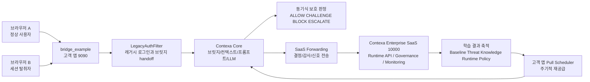

짧은 해설:
- 고객 브라우저는 고객 앱으로만 붙는다.
- Core는 고객 앱 안에서 동작한다.
- SaaS는 실시간 hot path가 아니라 ingest, 모니터링, 학습, 재공급 plane이다.

### 3.2 배포 아키텍처

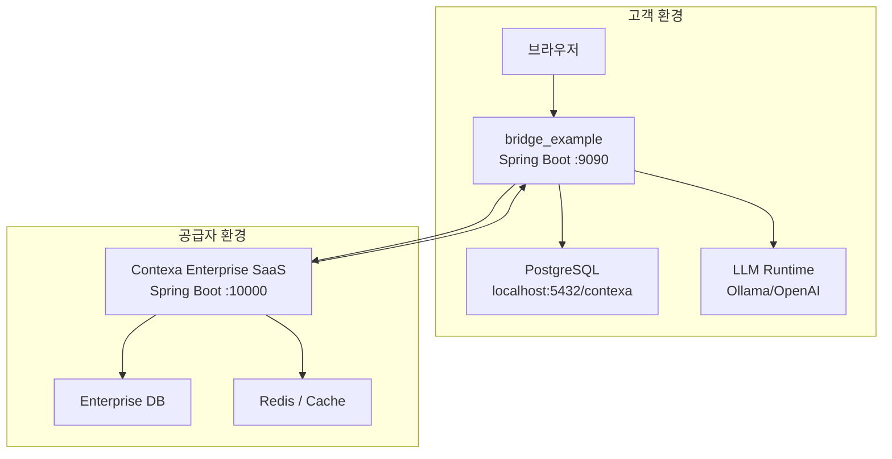

짧은 해설:
- LLM 호출은 고객 앱 안에서 일어난다.
- SaaS는 고객 앱의 모든 요청을 직접 중계하지 않는다.
- SaaS는 ingest와 pull-back 루프를 담당한다.

### 3.3 코드 패키지 기준 전체 구조

```mermaid
flowchart LR
    subgraph Bridge["브릿지 계층"]
        B01["contexa-common.security.bridge"]
        B02["LegacyAuthFilter\nbridge_example"]
    end

    subgraph Context["컨텍스트 계층"]
        C01["RequestInfoExtractor"]
        C02["DefaultCanonicalSecurityContextProvider"]
        C03["PromptContextComposer"]
    end

    subgraph Prompt["프롬프트 계층"]
        P01["SecurityDecisionStandardPromptTemplate"]
        P02["SecurityDecisionPromptSections"]
        P03["PromptExecutionMetadata"]
    end

    subgraph Decision["판정 계층"]
        D01["Layer1ContextualStrategy"]
        D02["Layer2ExpertStrategy"]
        D03["SecurityDecisionPostProcessor"]
        D04["AuthorizationManagerMethodInterceptor"]
    end

    subgraph Forward["고객->SaaS 전송"]
        F01["SecurityDecisionForwardingPayloadMapper"]
        F02["PromptContextAuditPayloadMapper"]
        F03["SaasForwardingHandler"]
    end

    subgraph SaaS["SaaS ingest / governance / learning"]
        S01["SaasRuntimeApiController"]
        S02["SecurityDecisionIngestionService"]
        S03["PromptContextAuditIngestionService"]
        S04["PromptRuntimeGovernanceReconciliationService"]
        S05["AiNativeCustomerAssuranceService"]
        S06["GlobalBaselineAggregatorService"]
        S07["ThreatOutcomeLearningService"]
    end

    subgraph PullBack["고객 pull-back"]
        R01["SaasBaselineSeedPullScheduler"]
        R02["SaasThreatSignalPullScheduler"]
        R03["SaasThreatKnowledgePackPullScheduler"]
        R04["SaasThreatKnowledgeRuntimePolicyPullScheduler"]
    end

    B02 --> B01 --> C01 --> C02 --> C03 --> P01 --> P02 --> P03 --> D01 --> D02 --> D03 --> D04
    D03 --> F01
    C03 --> F02
    F01 --> F03 --> S01 --> S02 --> S04 --> S05
    F02 --> S01 --> S03
    S02 --> S06 --> S07 --> R01
    S06 --> R02
    S07 --> R03
    S07 --> R04
    R01 --> C02
    R02 --> C02
    R03 --> C03
    R04 --> C03
```

## 4. 전체 흐름도

### 4.1 정상 사용자 전체 흐름

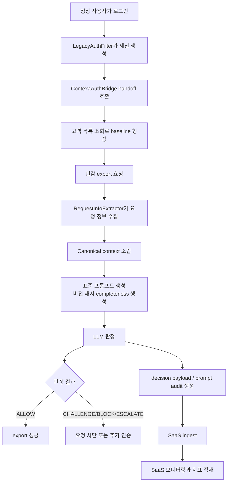

짧은 해설:
- 정상 경로도 SaaS로 흔적을 남겨야 한다.
- 정상 허용과 공격 차단 모두 관찰 가능해야 한다.

### 4.2 세션 탈취자 전체 흐름

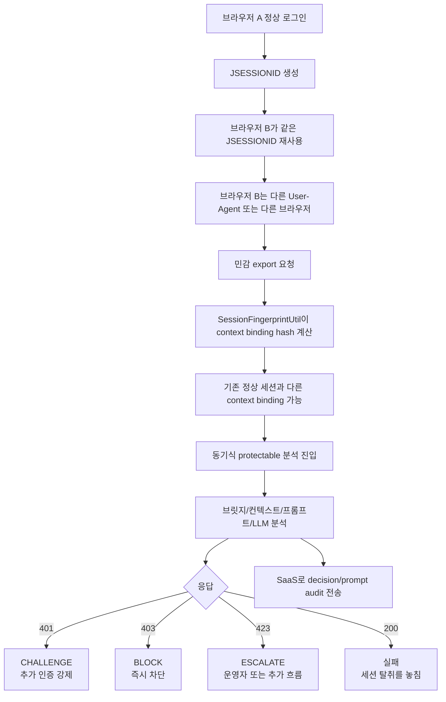

짧은 해설:
- 이번 리허설의 핵심 승부처는 `N`으로 빠지지 않는 것이다.

## 5. 전체 시퀀스

### 5.1 정상 사용자 시퀀스

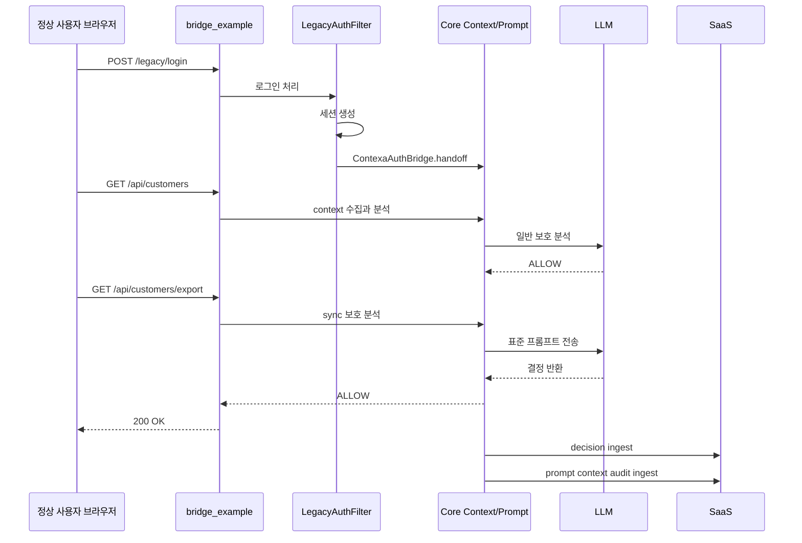

### 5.2 세션 탈취 시퀀스

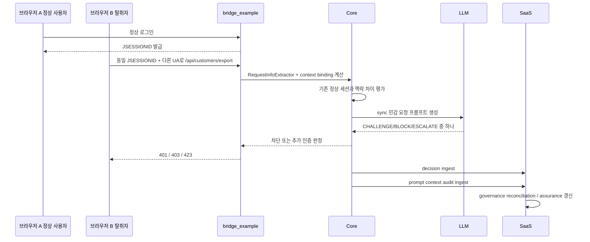

## 6. 메뉴별 아키텍처

### 6.1 고객 앱 메뉴 구조

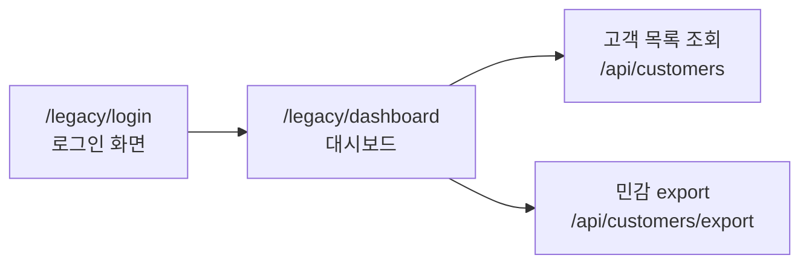

짧은 해설:
- 고객 앱 메뉴는 단순하지만, 실제 보호 판정은 `export`에서 가장 중요하다.

### 6.2 관리자 운영 메뉴 구조

소스 기준 컨트롤러:
- [EnterpriseOperationsController.java](D:/contexa-enterprise/contexa-iam-enterprise/src/main/java/io/contexa/contexaiamenterprise/admin/operations/controller/EnterpriseOperationsController.java)
- [SaasControlPlaneController.java](D:/contexa-enterprise/contexa-iam-enterprise/src/main/java/io/contexa/contexaiamenterprise/admin/operations/controller/SaasControlPlaneController.java)
- [SaasReleaseGovernanceController.java](D:/contexa-enterprise/contexa-iam-enterprise/src/main/java/io/contexa/contexaiamenterprise/admin/operations/controller/SaasReleaseGovernanceController.java)
- [SaasTenantPortalController.java](D:/contexa-enterprise/contexa-iam-enterprise/src/main/java/io/contexa/contexaiamenterprise/admin/operations/controller/SaasTenantPortalController.java)

```mermaid
flowchart TD
    A["/admin/enterprise\nEnterprise Home"] --> B["/admin/enterprise/zerotrust\nZero Trust Operations"]
    A --> C["/admin/enterprise/approvals\nApproval Inbox"]
    A --> D["/admin/enterprise/incidents\nSOAR Incident Console"]
    A --> E["/admin/enterprise/mcp\nMCP Operations"]
    A --> F["/admin/enterprise/permits\nPermit Registry"]
    A --> G["/admin/enterprise/executions\nExecution History"]
    A --> H["/admin/enterprise/playbooks\nPlaybooks and Prompts"]
    A --> I["/admin/enterprise/metrics\nMetrics and Dashboards"]
    A --> J["/admin/enterprise/integration\nSystem Integration"]

    K["/admin/saas/platform/tenants\nSaaS Tenant Control Plane"] --> L["Tenant Detail"]
    K --> M["Tenant Operations"]
    K --> N["Billing / Deployment / Quota"]
    K --> O["XAI / Feedback / Threat Knowledge / Assurance"]

    P["/admin/saas/release-governance\nRelease Governance"] --> Q["Canary / Telemetry / Runtime Governance"]

    R["/tenant/workspace\nTenant Workspace"] --> S["/tenant/overview\nTenant Overview"]
    S --> T["/tenant/operations\nTenant Operations"]
    S --> U["/tenant/protected-apps/{appGroupId}\nProtected App Detail"]
    S --> V["/tenant/clients\nService Clients"]
    S --> W["/tenant/invoices\nBilling and Compliance"]
```

짧은 해설:
- 관리자 메뉴는 공급자 운영 시점
- 테넌트 메뉴는 고객 관점
- 실전 리허설에서는 최소한 `Tenant Operations`, `Protected App Detail`, `SaaS Tenant Operations`, `Release Governance`가 관찰 포인트다.

### 6.3 메뉴별 시퀀스: 운영자가 결과를 보는 흐름

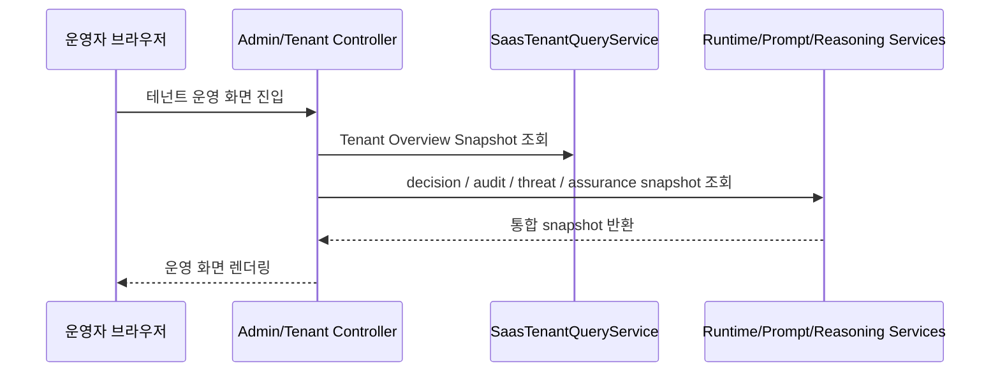

## 7. 기능별 아키텍처

### 7.1 브릿지 기능

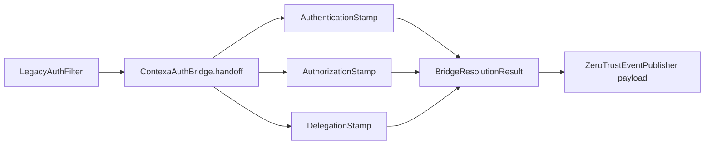

짧은 해설:
- 브릿지는 단순 세션 복사가 아니라 인증/권한/위임 의미를 stamp로 남긴다.

### 7.2 컨텍스트 수집 기능

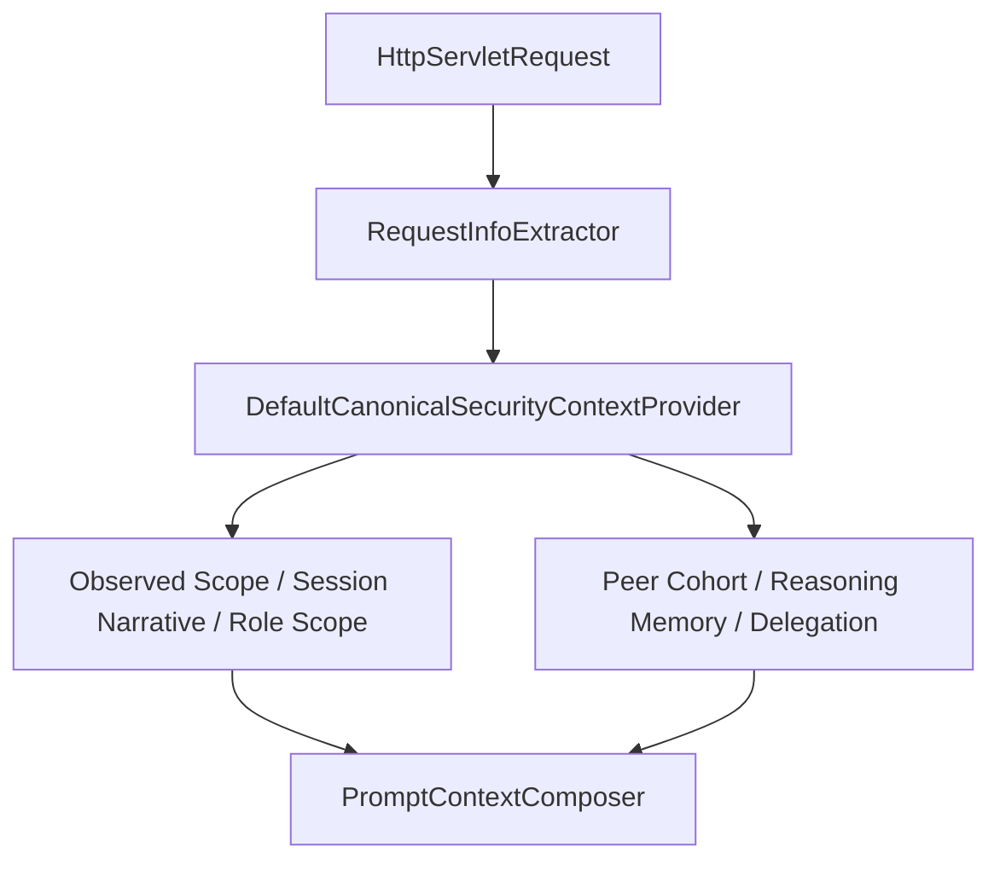

### 7.3 표준 프롬프트 기능

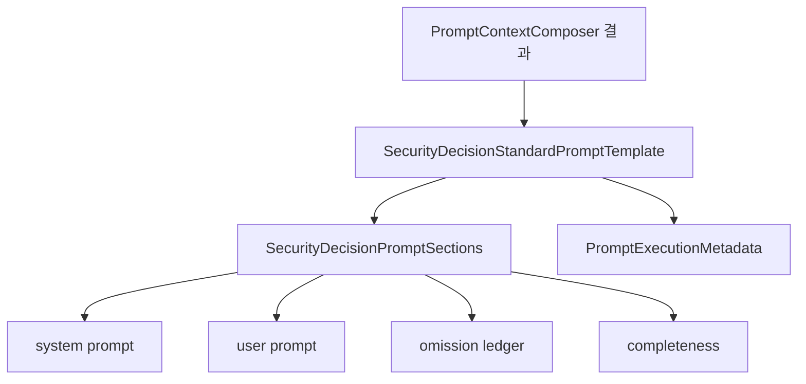

### 7.4 LLM 판정 기능

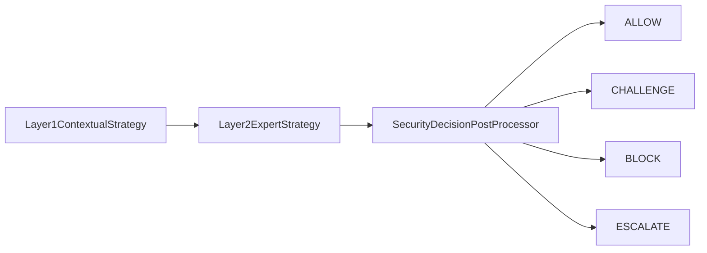

### 7.5 SaaS ingest 기능

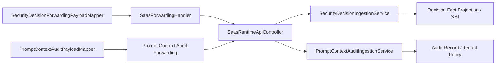

### 7.6 SaaS 학습과 재공급 기능

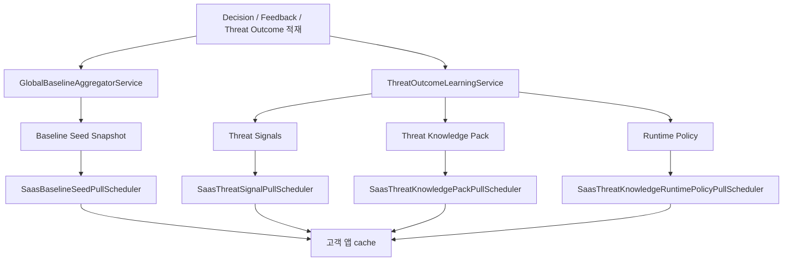

## 8. 흐름별 다이어그램

### 8.1 로그인 흐름

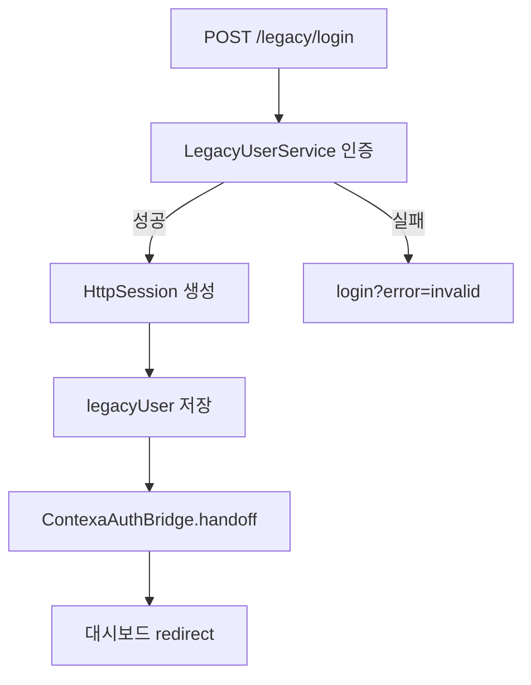

### 8.2 보호 API 조회 흐름

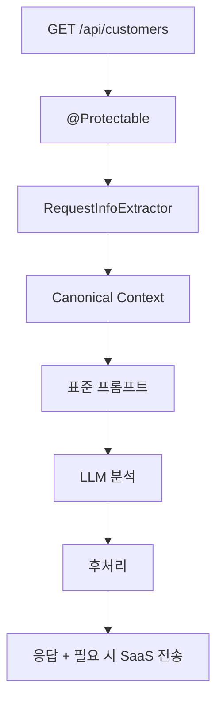

### 8.3 민감 export 동기 흐름

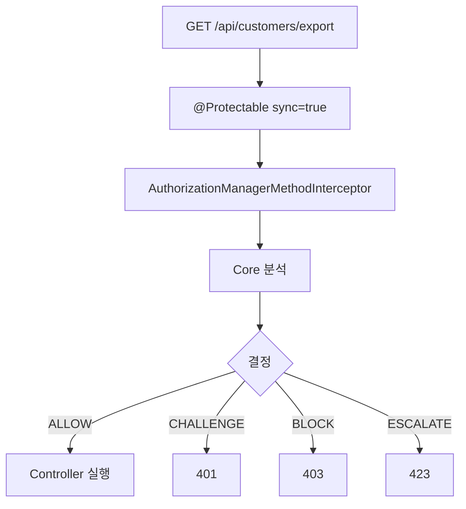

### 8.4 고객->SaaS 흐름

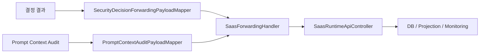

### 8.5 SaaS->고객 재공급 흐름

```mermaid
flowchart LR
    A["Baseline Seed"] --> B["SaasBaselineSeedService"]
    C["Threat Signals"] --> D["SaasThreatIntelligenceService"]
    E["Threat Knowledge Pack"] --> F["SaasThreatKnowledgePackService"]
    G["Runtime Policy"] --> H["SaasThreatKnowledgeRuntimePolicyService"]
    B --> I["다음 컨텍스트/프롬프트에 반영"]
    D --> I
    F --> I
    H --> I
```

## 9. 상태별 다이어그램

### 9.1 사용자 요청 상태

```mermaid
stateDiagram-v2
    [*] --> Login
    Login --> SessionEstablished: 로그인 성공
    SessionEstablished --> BaselineWarmup: 일반 조회
    BaselineWarmup --> SensitiveRequest: export 요청
    SensitiveRequest --> Allowed: ALLOW
    SensitiveRequest --> Challenged: CHALLENGE
    SensitiveRequest --> Blocked: BLOCK
    SensitiveRequest --> Escalated: ESCALATE
```

짧은 해설:
- 정상 사용자와 탈취자는 `SensitiveRequest`에서 갈린다.

### 9.2 prompt completeness 상태

```mermaid
stateDiagram-v2
    [*] --> COMPLETE
    COMPLETE --> PARTIAL: 일부 section omitted
    PARTIAL --> THIN: omitted 증가 또는 위험 누락
    THIN --> SEVERELY_OMITTED: 핵심 의미 손실 수준
```

짧은 해설:
- 이번 리허설에서 중요한 것은 `세션 탈취`의 핵심 의미가 `THIN`이나 `SEVERELY_OMITTED`로 망가지는지 여부다.

### 9.3 SaaS governance 상태

```mermaid
stateDiagram-v2
    [*] --> Ingested
    Ingested --> Reconciled
    Reconciled --> Alerted: mismatch or runtime risk
    Reconciled --> Assured: controlled and traceable
    Alerted --> Reviewed
    Reviewed --> Released
    Reviewed --> RolledBack
```

## 10. 순서도

### 10.1 리허설 진행 순서도

```mermaid
flowchart TD
    A["사전 코드 게이트 통과"] --> B["bridge_example SaaS 설정 추가"]
    B --> C["고객 앱 9090 기동"]
    C --> D["SaaS 앱 10000 기동"]
    D --> E["정상 로그인과 baseline warm-up"]
    E --> F["정상 export 관찰"]
    F --> G["세션 탈취 재현"]
    G --> H["hijacked export 판정 확인"]
    H --> I["브릿지/컨텍스트/프롬프트 증거 확인"]
    I --> J["SaaS ingest record 확인"]
    J --> K["SaaS 학습 결과 pull-back 확인"]
    K --> L["동일/유사 공격 재실행"]
    L --> M["개선 여부 비교"]
```

### 10.2 실패 처리 순서도

```mermaid
flowchart TD
    A["실패 발견"] --> B{"어느 단계인가"}
    B -->|브릿지| C["LegacyAuthFilter / handoff 수정"]
    B -->|컨텍스트| D["canonical context / composer 수정"]
    B -->|프롬프트| E["sections / omission / completeness 수정"]
    B -->|판정| F["strategy / prompt tuning / model 확인"]
    B -->|SaaS ingest| G["forwarding config / oauth / endpoint 확인"]
    B -->|pull-back| H["scheduler / feature flag / cache 확인"]
    C --> I["같은 단계부터 재실행"]
    D --> I
    E --> I
    F --> I
    G --> I
    H --> I
```

## 11. 운용 아키텍처

### 11.1 운영 관찰 아키텍처

```mermaid
flowchart LR
    A["고객 앱 로그"] --> O["운영자"]
    B["브라우저 HAR / DevTools"] --> O
    C["SaaS ingest DB"] --> O
    D["Prompt Governance Registry"] --> O
    E["Alert Feed"] --> O
    F["Customer Assurance"] --> O
    G["Threat Effectiveness / Lift"] --> O
```

짧은 해설:
- 운영자는 단일 화면만 보면 안 된다.
- 고객 앱 로그, 브라우저 응답, SaaS ingest, governance, assurance를 함께 봐야 한다.

### 11.2 관리자와 테넌트 운용 분리

```mermaid
flowchart LR
    P["플랫폼 관리자\n/admin/saas"] --> A["테넌트 제어, 릴리스, XAI, 학습 루프"]
    T["테넌트 운영자\n/tenant"] --> B["내 Protected App, 내 Operations, 내 Billing"]
    E["엔터프라이즈 운영자\n/admin/enterprise"] --> C["Zero Trust, Approvals, Incidents, MCP, Executions"]
```

짧은 해설:
- 같은 데이터라도 누가 보는지에 따라 화면과 책임이 다르다.

## 12. 기타 필요한 다이어그램

### 12.1 데이터 증거 맵

```mermaid
flowchart TD
    A["브라우저 응답 코드"] --> Z["최종 증거 패키지"]
    B["고객 앱 로그"] --> Z
    C["SaaS 앱 로그"] --> Z
    D["security_decision_ingestion_records"] --> Z
    E["prompt_context_audit"] --> Z
    F["xai_analysis_reports"] --> Z
    G["prompt_governance_* ledger"] --> Z
    H["baseline/threat cache refresh 로그"] --> Z
```

### 12.2 실전 테스트에서 반드시 확인할 클래스 지도

```mermaid
mindmap
  root((실전 리허설 핵심 클래스))
    고객 앱
      LegacyAuthFilter
      ProtectedCustomerController
      LegacyUserService
    Core 브릿지
      ContexaAuthBridge
      RequestInfoExtractor
      ZeroTrustEventPublisher
    Core 컨텍스트
      DefaultCanonicalSecurityContextProvider
      PromptContextComposer
    Core 프롬프트
      SecurityDecisionStandardPromptTemplate
      SecurityDecisionPromptSections
      PromptExecutionMetadata
    Core SaaS
      SecurityDecisionForwardingPayloadMapper
      PromptContextAuditPayloadMapper
      SaasForwardingHandler
      SaasBaselineSeedPullScheduler
      SaasThreatSignalPullScheduler
      SaasThreatKnowledgePackPullScheduler
      SaasThreatKnowledgeRuntimePolicyPullScheduler
    Enterprise SaaS
      SaasRuntimeApiController
      SecurityDecisionIngestionService
      PromptContextAuditIngestionService
      PromptRuntimeGovernanceReconciliationService
      AiNativeCustomerAssuranceService
      GlobalBaselineAggregatorService
      ThreatOutcomeLearningService
```

## 13. 다이어그램 읽는 법

이 문서에서 중요한 것은 다음 세 가지다.

1. `민감 export`가 전체 체인의 중심이라는 것
2. `세션 탈취자`는 단순한 로그인 실패자가 아니라 정상 세션을 훔친 공격자라는 것
3. 승부는 단순 탐지 로그가 아니라 `plain 200 금지`, `근거 추적 가능`, `SaaS 학습 결과 재반영` 세 가지를 동시에 보여 주는 것이다

이 세 가지가 이해되면 이번 실전 리허설의 구조를 제대로 이해한 것이다.

## 14. 메뉴별 추가 시퀀스

### 14.1 테넌트 운영 메뉴 시퀀스

```mermaid
sequenceDiagram
    participant T as 테넌트 운영자
    participant TP as SaasTenantPortalController
    participant Q as SaasTenantQueryService
    participant O as SaasTenantObservabilityService
    participant P as Prompt Runtime Services
    participant A as Assurance Services

    T->>TP: /tenant/operations 진입
    TP->>Q: tenant overview snapshot 조회
    TP->>O: observability snapshot 조회
    TP->>P: prompt governance / runtime snapshot 조회
    TP->>A: customer assurance snapshot 조회
    TP-->>T: 운영 화면 렌더링
```

짧은 해설:
- 테넌트 운영 메뉴는 "내 고객 앱이 실제로 어떤 판정을 내렸는가"를 보는 창구다.

### 14.2 플랫폼 제어 메뉴 시퀀스

```mermaid
sequenceDiagram
    participant P as 플랫폼 관리자
    participant SC as SaasControlPlaneController
    participant TQ as SaasTenantQueryService
    participant RL as SaasReleaseGovernanceService
    participant TG as Threat Knowledge / Runtime Override

    P->>SC: /admin/saas/platform/tenants/{tenantId}/operations 진입
    SC->>TQ: 테넌트 상태와 usage 조회
    SC->>RL: release governance snapshot 조회
    SC->>TG: runtime release / kill switch / rollback 상태 조회
    SC-->>P: 제어 화면 렌더링
```

짧은 해설:
- 플랫폼 메뉴는 고객 앱 hot path가 아니라 공급자 control plane을 다룬다.

## 15. 기능별 추가 시퀀스

### 15.1 프롬프트 생성 기능 시퀀스

```mermaid
sequenceDiagram
    participant R as Http Request
    participant X as RequestInfoExtractor
    participant C as DefaultCanonicalSecurityContextProvider
    participant P as PromptContextComposer
    participant T as SecurityDecisionStandardPromptTemplate
    participant S as SecurityDecisionPromptSections
    participant M as PromptExecutionMetadata

    R->>X: 요청 정보 수집
    X->>C: canonical context 재료 전달
    C->>P: context 완성
    P->>T: prompt context 전달
    T->>S: system/user section 계획
    S-->>T: omission ledger / completeness 반환
    T->>M: prompt metadata 생성
```

짧은 해설:
- 이 시퀀스는 "원본 의미를 유지한 컨텍스트가 어떻게 표준 프롬프트로 바뀌는가"를 보여 준다.

### 15.2 SaaS ingest 기능 시퀀스

```mermaid
sequenceDiagram
    participant D as SecurityDecisionPostProcessor
    participant F as SecurityDecisionForwardingPayloadMapper
    participant H as SaasForwardingHandler
    participant API as SaasRuntimeApiController
    participant I as SecurityDecisionIngestionService
    participant A as PromptContextAuditIngestionService

    D->>F: decision + prompt metadata 전달
    F->>H: forwarding payload 생성
    H->>API: /api/saas/runtime/xai/decision-ingestions POST
    H->>API: /api/saas/runtime/prompt-context-audits POST
    API->>I: decision ingest 처리
    API->>A: prompt audit ingest 처리
```

짧은 해설:
- 고객 앱이 어떤 내용을 SaaS로 보내는지, ingest가 어디서 갈리는지 한눈에 보이게 한 다이어그램이다.

### 15.3 SaaS 재공급 기능 시퀀스

```mermaid
sequenceDiagram
    participant SCH as Pull Scheduler
    participant API as SaasRuntimeApiController
    participant Q as SaasTenantQueryService
    participant B as SaasBaselineSeedService
    participant TI as SaasThreatIntelligenceService
    participant TK as SaasThreatKnowledgePackService
    participant RP as SaasThreatKnowledgeRuntimePolicyService

    SCH->>API: baseline seed / threat endpoints 조회
    API->>Q: tenant-bound snapshot 조회
    Q-->>API: baseline / signal / knowledge / policy 반환
    API-->>SCH: HTTP 응답
    SCH->>B: baseline cache 갱신
    SCH->>TI: threat signal cache 갱신
    SCH->>TK: knowledge pack cache 갱신
    SCH->>RP: runtime policy cache 갱신
```

짧은 해설:
- 현재 코드는 실시간 push가 아니라 scheduler 기반 pull이다.

## 16. 상태별 추가 다이어그램

### 16.1 세션 상태 흐름도

```mermaid
flowchart TD
    A["Anonymous"] --> B["Authenticated Session"]
    B --> C["Warm Baseline"]
    C --> D["Sensitive Request"]
    D --> E{"Context Binding 동일한가"}
    E -->|예| F["정상 경로 분석"]
    E -->|아니오| G["재분석 경로"]
    F --> H["ALLOW 또는 조건부 판정"]
    G --> I["CHALLENGE/BLOCK/ESCALATE 가능"]
```

### 16.2 판정 상태 시퀀스

```mermaid
sequenceDiagram
    participant Req as 요청
    participant Int as AuthorizationManagerMethodInterceptor
    participant Core as Cortex Core
    participant Ex as ZeroTrustAccessDeniedException
    participant Res as HTTP Response

    Req->>Int: @Protectable sync 요청
    Int->>Core: 분석 위임
    Core-->>Int: ALLOW / CHALLENGE / BLOCK / ESCALATE
    alt ALLOW
        Int-->>Res: 200
    else CHALLENGE
        Int->>Ex: challenge 예외 생성
        Ex-->>Res: 401
    else BLOCK
        Int->>Ex: block 예외 생성
        Ex-->>Res: 403
    else ESCALATE
        Int->>Ex: escalate 예외 생성
        Ex-->>Res: 423
    end
```

짧은 해설:
- 실전 테스트에서는 이 응답 코드가 핵심 결과물이다.

## 17. 운용 시퀀스

### 17.1 운영자 조사 시퀀스

```mermaid
sequenceDiagram
    participant O as 운영자
    participant UI as 운영 화면
    participant DB as SaaS DB
    participant QA as Prompt Context Audit
    participant DI as Decision Ingestion
    participant AS as Assurance

    O->>UI: hijacked 요청 결과 확인
    UI->>DI: decision 기록 조회
    UI->>QA: prompt context audit 조회
    UI->>AS: assurance / alert 조회
    DI->>DB: ingestion record 조회
    QA->>DB: audit record 조회
    AS->>DB: assurance evidence 조회
    UI-->>O: 동일 correlation 기준으로 통합 표시
```

짧은 해설:
- 운영자는 로그 한 줄이 아니라 correlation 기준으로 전 구간을 이어서 봐야 한다.

### 17.2 재배포 운용 시퀀스

```mermaid
sequenceDiagram
    participant P as 플랫폼 관리자
    participant GOV as Release Governance
    participant SAAS as SaaS Runtime Services
    participant SCH as Customer Pull Scheduler
    participant CORE as Customer Core

    P->>GOV: release / review / rollback 승인
    GOV->>SAAS: approved snapshot 노출
    SCH->>SAAS: 주기적 pull
    SAAS-->>SCH: baseline / signal / knowledge / policy 반환
    SCH->>CORE: 로컬 cache 업데이트
    CORE->>CORE: 다음 요청 분석에 반영
```

짧은 해설:
- 이 루프가 실제로 살아 있어야 "SaaS 학습이 고객 판정 개선으로 이어진다"는 말을 할 수 있다.
